# HỌC VIỆN CÔNG NGHỆ BƯU CHÍNH VIỄN THÔNG RIKKEISOFT
# KHOA CÔNG NGHỆ THÔNG TIN
---
<br><br><br>

<p align="center">
  <font size="6"><b>BÁO CÁO BÀI TẬP LỚN</b></font><br>
  <font size="5"><b>MÔN: PHÂN TÍCH VÀ THIẾT KẾ HỆ THỐNG PHẦN MỀM</b></font><br><br><br>
  <font size="5"><b>ĐỀ TÀI: XÂY DỰNG HỆ THỐNG QUẢN LÝ ĐĂNG KÝ TÍN CHỈ (CRMS)</b></font>
</p>

<br><br><br><br><br>

<table align="center">
  <tr>
    <td><b>Giảng viên hướng dẫn:</b></td>
    <td>Bùi Thanh Hải</td>
  </tr>
  <tr>
    <td><b>Đơn vị công tác của giảng viên:</b></td>
    <td>Khoa Công nghệ Thông tin - Học viện Công nghệ Bưu chính Viễn thông Rikkeisoft</td>
  </tr>
  <tr>
    <td><b>Chương trình đào tạo:</b></td>
    <td>Hệ thống thông tin quản lý / Công nghệ thông tin</td>
  </tr>
  <tr>
    <td><b>Lớp:</b></td>
    <td>CNTT2</td>
  </tr>
  <tr>
    <td><b>Sinh viên thực hiện:</b></td>
    <td>Nguyễn Văn An (Mã SV: 22110001)</td>
  </tr>
</table>

<br><br><br><br>
<p align="center">Hà Nội – 2026</p>

---
<div style="page-break-after: always;"></div>

# NHẬN XÉT CỦA GIẢNG VIÊN HƯỚNG DẪN
...............................................................................................................................................................................................
...............................................................................................................................................................................................
...............................................................................................................................................................................................
...............................................................................................................................................................................................
...............................................................................................................................................................................................

**Điểm đánh giá:** .................... / 10

<p align="right"><i>Hà Nội, ngày ... tháng ... năm 2026</i><br><b>Giảng viên ký tên</b></p>

---
<div style="page-break-after: always;"></div>

# LỜI CẢM ƠN
Lời đầu tiên, em xin gửi lời cảm ơn chân thành và sâu sắc đến Học viện Công nghệ Bưu chính Viễn thông Rikkeisoft, đặc biệt là Khoa Công nghệ Thông tin, vì đã tạo ra một môi trường học tập hiện đại, năng động và giàu tính thực tiễn. Nhờ có sự đầu tư, quan tâm sát sao trong công tác giảng dạy, nghiên cứu khoa học và định hướng nghề nghiệp, em đã có cơ hội được rèn luyện kiến thức chuyên môn, phát triển kỹ năng tư duy độc lập, cũng như tích lũy nhiều kinh nghiệm quý báu trong suốt quá trình học tập và trưởng thành tại Học viện.

Đồ án tốt nghiệp là một học phần có ý nghĩa đặc biệt quan trọng, đánh dấu bước chuyển mình từ môi trường học đường sang môi trường làm việc thực tế. Trong khuôn khổ môn học này, em không chỉ được tiếp cận và giải quyết một bài toán thực tiễn có tính ứng dụng cao, mà còn có cơ hội nghiên cứu, tìm hiểu các công nghệ hiện đại, tiếp cận xu hướng phát triển của ngành công nghệ thông tin, từ đó trang bị hành trang vững chắc cho sự nghiệp sau này.

Em xin bày tỏ lòng biết ơn sâu sắc đến thầy cô hướng dẫn – người đã luôn tận tâm, nhiệt huyết trong việc truyền đạt kiến thức, định hướng nghiên cứu và không ngừng hỗ trợ, động viên em trong suốt quá trình thực hiện đồ án. Những góp ý chuyên môn quý báu cùng sự đồng hành của thầy cô là nguồn động lực to lớn giúp em vượt qua những khó khăn, thử thách để hoàn thành tốt đồ án này.

Dù đã rất nỗ lực, chắc chắn trong quá trình thực hiện và trình bày đồ án sẽ không tránh khỏi những thiếu sót. Em rất mong nhận được sự góp ý của quý thầy cô để sản phẩm được hoàn thiện hơn và em có thể tiếp tục cải thiện bản thân trong chặng đường sắp tới.

Một lần nữa, em xin chân thành cảm ơn!

<p align="right"><b>Sinh viên thực hiện</b></p>

---
<div style="page-break-after: always;"></div>

# LỜI CAM ĐOAN
Em xin cam đoan rằng, đề tài “Xây dựng hệ thống quản lý đăng ký tín chỉ (CRMS)” là công trình nghiên cứu của em, được thực hiện dưới sự hướng dẫn của giảng viên hướng dẫn. Tất cả các nội dung trong đồ án đều do em tự nghiên cứu, triển khai và hoàn thành. Các số liệu, kết quả trong đồ án là hoàn toàn chính xác, không sao chép, không vi phạm quyền sở hữu trí tuệ của bất kỳ tổ chức hay cá nhân nào.

Em xin cam kết rằng, mọi tài liệu tham khảo trong đồ án đều được trích dẫn đầy đủ, rõ ràng, tuân thủ đúng các quy định về bản quyền và trích dẫn nguồn. Đồ án này chưa từng được nộp và xét duyệt ở bất kỳ trường nào dưới bất kỳ hình thức nào.

Nếu có bất kỳ sai sót nào, em xin chịu trách nhiệm và cam kết sửa chữa kịp thời.

<p align="right"><b>Sinh viên thực hiện</b></p>

---
<div style="page-break-after: always;"></div>

# MỤC LỤC
1. **LỜI CẢM ƠN**
2. **LỜI CAM ĐOAN**
3. **DANH MỤC HÌNH VẼ**
4. **DANH MỤC BẢNG BIỂU**
5. **LỜI MỞ ĐẦU**
6. **CHƯƠNG 1: TỔNG QUAN VỀ HỆ THỐNG QUẢN LÝ ĐĂNG KÝ TÍN CHỈ (CRMS)**
   * 1.1. Giới thiệu
     * 1.1.1. Khái niệm và mục đích
     * 1.1.2. Quy trình hoạt động
     * 1.1.3. Các mô hình kiểm soát ràng buộc nghiệp vụ trong đăng ký tín chỉ
     * 1.1.4. So sánh các hệ thống đăng ký tín chỉ phổ biến
   * 1.2. Hiện trạng triển khai tại các trường đại học
     * 1.2.1. Các trường đại học trên thế giới
     * 1.2.2. Các trường đại học trong nước
   * 1.3. Các thành phần chính của hệ thống
     * 1.3.1. Thành phần quản lý người dùng
     * 1.3.2. Thành phần quản lý môn học và học phần
     * 1.3.3. Thành phần kiểm soát và xử lý đăng ký tín chỉ
     * 1.3.4. Thành phần quản lý công nợ và thanh toán học phí
     * 1.3.5. Thành phần theo dõi và báo cáo
     * 1.3.6. Giao diện và khả năng truy cập
     * 1.3.7. Thành phần bảo mật và lưu trữ
   * 1.4. Nghiên cứu đề xuất
     * 1.4.1. Phát biểu bài toán
     * 1.4.2. Mục đích, mục tiêu
     * 1.4.3. Phạm vi
     * 1.4.4. Giải pháp đề xuất và công nghệ sử dụng
   * 1.5. Kế hoạch thực hiện dự án
7. **CHƯƠNG 2: PHÂN TÍCH VÀ THIẾT KẾ HỆ THỐNG**
   * 2.1. Mô hình nghiệp vụ của hệ thống
   * 2.2. Phân tích yêu cầu hệ thống
     * 2.2.1. Xác định các ca sử dụng
     * 2.2.2. Xây dựng biểu đồ ca sử dụng
     * 2.2.3. Đặc tả ca sử dụng
   * 2.3. Mô hình hóa hoạt động của hệ thống
     * 2.3.1. Mô hình hoạt động xác thực và điều hướng
     * 2.3.2. Biểu đồ tuần tự hoạt động tra cứu lớp học phần mở
     * 2.3.3. Biểu đồ luồng/tuần tự hoạt động đăng ký/hủy lớp học phần
     * 2.3.4. Biểu đồ luồng/tuần tự hoạt động mở lớp học phần mới
     * 2.3.5. Biểu đồ tuần tự hoạt động thanh toán học phí qua VNPAY
   * 2.4. Biểu đồ lớp của hệ thống
   * 2.5. Thiết kế cơ sở dữ liệu
     * 2.5.1. Thiết kế mức khái niệm
     * 2.5.2. Thiết kế mức vật lý
   * 2.6. Thiết kế giao diện người dùng (UI/UX)
     * 2.6.1. Thiết kế wireframe giao diện cho sinh viên
     * 2.6.2. Thiết kế wireframe giao diện cho giảng viên
     * 2.6.3. Thiết kế wireframe giao diện cho quản trị viên
8. **CHƯƠNG 3: CÀI ĐẶT VÀ KIỂM THỬ HỆ THỐNG**
   * 3.1. Bảo mật hệ thống
     * 3.1.1. Cấu hình CORS và phòng ngừa các lỗ hổng bảo mật
     * 3.1.2. Mã hóa mật khẩu
   * 3.2. Xây dựng giao diện hệ thống
     * 3.2.1. Giao diện cho sinh viên
     * 3.2.2. Giao diện cho giảng viên
     * 3.2.3. Giao diện cho admin
   * 3.3. Tích hợp cổng thanh toán trực tuyến
     * 3.3.1. Quy trình giao dịch thanh toán qua cổng giả lập VNPAY
     * 3.3.2. Tích hợp tự động giữa kết quả đăng ký môn học và công nợ học phí
     * 3.3.3. Tùy chỉnh quy tắc học phí học kỳ
   * 3.4. Xây dựng mô đun
     * 3.4.1. Mô đun: Đăng ký lớp học phần và kiểm soát trùng lịch (STUD_02)
     * 3.4.2. Mô đun: Kiểm tra môn học tiên quyết trước khi đăng ký (STUD_02)
     * 3.4.3. Mô đun: Phòng đào tạo quản lý mở lớp học phần mới và kiểm tra trùng lịch giảng dạy (REG_02)
     * 3.4.4. Mô đun: Phòng đào tạo hủy lớp sĩ số thấp và hoàn học phí tự động (REG_02)
   * 3.5. Thử nghiệm
     * 3.5.1. Kiểm thử chức năng kiểm soát trùng lịch học và tiên quyết
     * 3.5.2. Kiểm thử kiểm soát giới hạn số tín chỉ tối thiểu/tối đa
     * 3.5.3. Kiểm thử kiểm soát lịch dạy trùng của giảng viên
     * 3.5.4. Kiểm thử quy trình hủy lớp học phần sĩ số thấp và tự động hoàn trả học phí
9. **KẾT LUẬN**
10. **TÀI LIỆU THAM KHẢO**

---
<div style="page-break-after: always;"></div>

# DANH MỤC HÌNH VẼ
* **Hình 2.1:** Sơ đồ Use Case tổng thể hệ thống CRMS
* **Hình 2.2:** Sơ đồ Use Case bộ phận phân hệ Xác thực
* **Hình 2.3:** Sơ đồ Use Case bộ phận phân hệ Tra cứu Lớp HP
* **Hình 2.4:** Sơ đồ Use Case bộ phận phân hệ Đăng ký tín chỉ
* **Hình 2.5:** Sơ đồ Use Case bộ phận phân hệ Thời khóa biểu
* **Hình 2.6:** Sơ đồ Use Case bộ phận phân hệ Công nợ & Thanh toán
* **Hình 2.7:** Sơ đồ Use Case bộ phận phân hệ Lịch giảng dạy
* **Hình 2.8:** Sơ đồ Use Case bộ phận phân hệ Quản lý Lớp giảng dạy
* **Hình 2.9:** Sơ đồ Use Case bộ phận phân hệ Quản lý Môn học
* **Hình 2.10:** Sơ đồ Use Case bộ phận phân hệ Quản lý Lớp HP
* **Hình 2.11:** Sơ đồ Use Case bộ phận phân hệ Đợt đăng ký
* **Hình 2.12:** Sơ đồ Use Case bộ phận phân hệ Thống kê Báo cáo
* **Hình 2.13:** Sơ đồ Tuần tự quá trình Đăng nhập (AUTH_01)
* **Hình 2.14:** Sơ đồ Tuần tự chức năng Tra cứu (STUD_01)
* **Hình 2.15:** Sơ đồ luồng hoạt động đăng ký/hủy lớp học phần (STUD_02)
* **Hình 2.16:** Sơ đồ tuần tự hoạt động mở lớp học phần mới (REG_02)
* **Hình 2.17:** Sơ đồ tuần tự hoạt động thanh toán học phí qua VNPAY (STUD_04)
* **Hình 2.18:** Sơ đồ lớp của hệ thống (Class Diagram)
* **Hình 2.19:** Sơ đồ quan hệ thực thể ERD tổng thể
* **Hình 2.20:** Giao diện Mockup trang Đăng nhập (Login UI)
* **Hình 2.21:** Giao diện Mockup tra cứu lớp học phần (Search UI)
* **Hình 2.22:** Giao diện Mockup cổng đăng ký tín chỉ trực tuyến (Registration Window UI)
* **Hình 2.23:** Giao diện Mockup Thời khóa biểu cá nhân sinh viên (Schedule UI)
* **Hình 2.24:** Giao diện Mockup công nợ & thanh toán học phí trực tuyến (Tuition Window UI)
* **Hình 2.25:** Giao diện Mockup Lịch giảng dạy của giảng viên (Lecturer Schedule UI)
* **Hình 2.26:** Giao diện Mockup danh sách sinh viên lớp học phần (Class List UI)
* **Hình 2.27:** Giao diện Mockup Quản lý danh mục môn học (Course Catalog UI)
* **Hình 2.28:** Giao diện Mockup Báo cáo thống kê đăng ký tín chỉ (Reports & Analytics UI)

---
<div style="page-break-after: always;"></div>

# DANH MỤC BẢNG BIỂU
* **Bảng 1.1:** Bảng so sánh các hệ thống đăng ký học phần
* **Bảng 1.2:** Kế hoạch thực hiện dự án
* **Bảng 2.1:** Đặc tả chi tiết Use Case Đăng ký học phần (STUD_02)
* **Bảng 2.2:** Đặc tả chi tiết Use Case Hủy lớp học phần sĩ số thấp (REG_02)
* **Bảng 2.3:** Cấu trúc bảng `students` (Sinh viên)
* **Bảng 2.4:** Cấu trúc bảng `subjects` (Môn học)
* **Bảng 2.5:** Cấu trúc bảng `class_offerings` (Lớp học phần mở)
* **Bảng 2.6:** Cấu trúc bảng `class_schedules` (Lịch học chi tiết)
* **Bảng 2.7:** Cấu trúc bảng `registrations` (Kết quả đăng ký)
* **Bảng 2.8:** Cấu trúc bảng `tuition_invoices` (Hóa đơn công nợ học phí)
* **Bảng 2.9:** Cấu trúc bảng `payment_receipts` (Biên lai giao dịch)

---
<div style="page-break-after: always;"></div>

# LỜI MỞ ĐẦU
Trong các trường đại học đào tạo theo học chế tín chỉ nói chung và Học viện Công nghệ Bưu chính Viễn thông Rikkeisoft nói riêng, việc đăng ký tín chỉ là một hoạt động vô cùng quan trọng diễn ra định kỳ mỗi học kỳ. Hoạt động này ảnh hưởng trực tiếp đến kế hoạch học tập, thời khóa biểu của hàng chục nghìn sinh viên và kế hoạch giảng dạy, sắp xếp phòng học của Nhà trường.

Hiện nay, việc đăng ký học phần thường đối mặt với các thách thức lớn như hệ thống bị nghẽn mạng do lượng truy cập cực lớn tại cùng một thời điểm, các vấn đề về ràng buộc trùng lịch học, trùng lịch dạy, kiểm soát môn học tiên quyết, công nợ học phí của sinh viên và sĩ số tối thiểu/tối đa của lớp học phần. 

Nhằm giải quyết triệt để các bài toán nghiệp vụ trên, em đã tiến hành nghiên cứu và thực hiện đề tài: **"Xây dựng hệ thống quản lý đăng ký tín chỉ (CRMS)"**. Hệ thống được xây dựng trên nền tảng công nghệ Java Spring Boot kết hợp với ReactJS, cung cấp một giải pháp toàn diện cho sinh viên đăng ký học phần, giảng viên xem lịch dạy và Phòng Đào tạo quản trị, giám sát và thống kê hoạt động này một cách hiệu quả và tự động hóa.

---
<div style="page-break-after: always;"></div>


# CHƯƠNG 1: TỔNG QUAN VỀ HỆ THỐNG QUẢN LÝ ĐĂNG KÝ TÍN CHỈ (CRMS)


## 1.1. Giới thiệu

### 1.1.1. Khái niệm và mục đích
Hệ thống quản lý đăng ký tín chỉ trực tuyến (CRMS) là một giải pháp phần mềm tự động hóa toàn bộ quy trình từ việc lập kế hoạch mở lớp, phân công giảng dạy, đăng ký lớp học phần của sinh viên, cho tới tính toán và thanh toán công nợ học phí. 
Mục đích chính của hệ thống bao gồm:
1. **Tối ưu hóa quy trình đăng ký:** Thay thế hoàn toàn quy trình nhận phiếu đăng ký học bằng giấy hoặc các cổng thông tin cũ thường xuyên nghẽn mạng.
2. **Kiểm soát tính đúng đắn dữ liệu thời gian thực:** Đảm bảo tất cả các quy tắc ràng buộc (trùng lịch học, điều kiện tiên quyết, giới hạn sĩ số, giới hạn tín chỉ đăng ký) được kiểm soát tự động tại chỗ.
3. **Quản trị tài chính minh bạch:** Kết nối trực tiếp giữa việc đăng ký lớp học phần của sinh viên với việc cập nhật công nợ học phí, hỗ trợ cổng giả lập thanh toán giúp sinh viên thanh toán tức thì.
4. **Tối ưu hóa tài nguyên giảng đường:** Tự động hóa việc rà soát sĩ số lớp học, cảnh báo và hủy lớp có sĩ số thấp để điều phối lại giảng viên và phòng học hợp lý.

### 1.1.2. Quy trình hoạt động
Quy trình hoạt động tổng thể của hệ thống CRMS xoay quanh 4 bước nghiệp vụ cốt lõi sau:
1. **Lên kế hoạch và mở lớp:** Nhân viên Phòng Đào tạo tạo thông tin môn học, thiết lập lớp học phần, phân công giảng viên, chọn phòng học và khung giờ học (Thứ, Tiết). Hệ thống tự động kiểm tra xung đột lịch dạy của giảng viên và lịch sử dụng phòng học trước khi cho phép lưu lại lớp học phần ở trạng thái `"open"`.
2. **Đăng ký tín chỉ trực tuyến:** Sinh viên đăng nhập vào hệ thống khi đợt đăng ký mở. Sinh viên tra cứu hoặc nhập mã lớp học phần để đăng ký. Hệ thống chạy bộ lọc xác thực để kiểm soát trùng lịch, môn tiên quyết, giới hạn sĩ số và số tín chỉ tối đa. Nếu hợp lệ, hệ thống tạo bản ghi đăng ký `"SUCCESS"` và tự động cập nhật sĩ số thực tế.
3. **Thanh toán học phí:** Hệ thống tự động tính học phí (Số tín chỉ đăng ký x 500,000đ/tín chỉ) và cập nhật hóa đơn công nợ. Sinh viên thực hiện thanh toán trực tuyến qua cổng giả lập VNPAY. Hệ thống ghi nhận kết quả và đổi trạng thái hóa đơn sang `"paid"`.
4. **Hủy lớp sĩ số thấp:** Sau khi kết thúc đợt đăng ký, Phòng Đào tạo duyệt các lớp học phần có sĩ số thấp dưới mức tối thiểu. Lớp học phần được hủy (`"cancelled"`), hệ thống tự động hủy toàn bộ các đăng ký của sinh viên thuộc lớp đó và hoàn trả học phí tương ứng vào tài khoản công nợ của sinh viên.

### 1.1.3. Các mô hình kiểm soát ràng buộc nghiệp vụ trong đăng ký tín chỉ
Trong hệ thống đăng ký tín chỉ CRMS, các ràng buộc nghiệp vụ được thiết lập dưới dạng các quy tắc chốt chặn tự động tại Backend:
- **Mô hình kiểm soát thời khóa biểu (Schedule Validation):** Kiểm tra xem lớp học phần mới đăng ký có bị giao thoa (overlap) về thời gian học (Thứ, Tiết bắt đầu -> Tiết kết thúc) với các lớp đã đăng ký thành công trước đó hay không.
- **Mô hình kiểm soát môn học tiên quyết (Prerequisite Verification):** Sinh viên chỉ được phép đăng ký môn học nâng cao nếu trong lịch sử đăng ký của các học kỳ trước đã đăng ký thành công môn học tiên quyết quy định.
- **Mô hình kiểm soát hạn mức tín chỉ (Credit Limit Enforcement):** Ràng buộc sinh viên đăng ký tối thiểu 12 tín chỉ (đảm bảo điều kiện học chính quy) và tối đa 25 tín chỉ (giới hạn năng lực học tập bình thường) trong một học kỳ chính.
- **Mô hình kiểm soát sĩ số (Class Capacity Constraint):** Tránh vượt quá sức chứa phòng học hoặc quy mô giảng dạy tối đa của giảng viên (`enrolled < maxStudents`).

### 1.1.4. So sánh các hệ thống đăng ký tín chỉ phổ biến
Dưới đây là bảng so sánh hệ thống đăng ký học phần CRMS được đề xuất với các hệ thống quản lý học tập và đăng ký tín chỉ truyền thống tại Việt Nam:

| Tiêu chí so sánh | Hệ thống CRMS đề xuất | Hệ thống Moodle (tích hợp) | Hệ thống Portal cũ (SIS) |
| :--- | :--- | :--- | :--- |
| **Tốc độ phản hồi** | Rất nhanh (phân tách API và DB tối ưu) | Trung bình (thường bị nghẽn khi truy cập đông) | Chậm, dễ sập server khi mở cổng |
| **Kiểm soát trùng lịch** | Tự động cảnh báo tức thì dựa trên khung thời gian (tiết học) | Không hỗ trợ tự động theo tiết học | Kiểm tra cơ bản nhưng phản hồi chậm |
| **Kiểm soát môn tiên quyết** | Kiểm tra tự động lịch sử đăng ký của sinh viên | Hạn chế, cần cấu hình phức tạp | Có hỗ trợ nhưng dữ liệu hay bị đồng bộ chậm |
| **Tự động xử lý sĩ số thấp** | Tự động hủy lớp và hoàn trả học phí vào ví công nợ | Không hỗ trợ | Phải thực hiện thủ công bằng Excel sau đợt |
| **Giao diện người dùng** | Hiện đại, responsive tốt trên Mobile và Desktop | Phức tạp, nhiều menu thừa | Cũ kỹ, khó thao tác trên thiết bị di động |

<p align="center"><b>Bảng 1.1: Bảng so sánh các hệ thống đăng ký học phần</b></p>

## 1.2. Hiện trạng triển khai tại các trường đại học

### 1.2.1. Các trường đại học trên thế giới
Hầu hết các trường đại học danh tiếng trên thế giới đều sử dụng các hệ thống thông tin sinh viên (SIS - Student Information System) tích hợp mạnh mẽ như Banner, PeopleSoft.
- **Viện Công nghệ Massachusetts (MIT):** Sử dụng hệ thống cổng thông tin tích hợp WebSIS kết hợp với cơ sở dữ liệu tập trung lớn. WebSIS cho phép đăng ký trực tuyến kết hợp với kiểm soát điều kiện tiên quyết chặt chẽ, hiển thị trực quan biểu đồ thời khóa biểu tuần và liên kết tự động tới các hệ thống thanh toán điện tử của ngân hàng.
- **Đại học Stanford:** Sử dụng hệ thống Stanford Axess tích hợp toàn diện từ đăng ký học phần, xem kết quả học tập cho tới quản lý tài chính sinh viên. Hệ thống được thiết kế với độ chịu tải cao nhờ công nghệ đám mây và cơ chế hàng đợi thông minh khi mở đăng ký tín chỉ.

### 1.2.2. Các trường đại học trong nước
Tại Việt Nam, các trường đại học lớn đang chuyển dần từ các hệ thống Portal cũ sang các giải pháp tích hợp:
- **Học viện Công nghệ Bưu chính Viễn thông Rikkeisoft:** Sử dụng cổng thông tin đăng ký qldt.ptit.edu.vn. Hệ thống có khả năng xử lý lượng truy cập tương đối tốt nhưng vẫn thỉnh thoảng gặp hiện tượng nghẽn mạng cục bộ trong những phút đầu tiên mở cổng đăng ký.
- **Trường Đại học FPT:** Triển khai hệ thống FAP (FPT Academic Portal) quản lý tập trung từ đăng ký học, điểm danh, lịch học hàng ngày cho đến học phí. FAP được đánh giá cao về độ ổn định nhờ áp dụng cơ chế phân tải theo từng block sinh viên đăng ký.

## 1.3. Các thành phần chính của hệ thống

### 1.3.1. Thành phần quản lý người dùng
Quản lý thông tin và tài khoản đăng nhập của các đối tượng: **Sinh viên** (tra cứu, đăng ký môn học, nộp phí), **Giảng viên** (xem lịch dạy, quản lý lớp) và **Nhân viên Phòng Đào tạo** (cấu hình hệ thống, quản trị lớp, xem báo cáo).

### 1.3.2. Thành phần quản lý môn học và học phần
Lưu trữ danh mục môn học toàn trường, số tín chỉ, khoa phụ trách, và cấu hình môn học yêu cầu tiên quyết. Đồng thời, thiết lập các lớp học phần mở trong từng học kỳ cụ thể (gắn với phòng học, giảng viên, thời gian).

### 1.3.3. Thành phần kiểm soát và xử lý đăng ký tín chỉ
Đây là thành phần cốt lõi xử lý các yêu cầu đăng ký/hủy lớp của sinh viên. Thành phần này thực thi công cụ kiểm tra xung đột lịch học, môn học tiên quyết, sĩ số lớp, giới hạn tín chỉ đăng ký và chốt kết quả đăng ký chính thức của sinh viên.

### 1.3.4. Thành phần quản lý công nợ và thanh toán học phí
Theo dõi các hóa đơn học phí phát sinh theo học kỳ của sinh viên. Tự động tính học phí theo tổng tín chỉ và tích hợp với cổng thanh toán giả lập VNPAY để ghi nhận và cập nhật công nợ học phí thời gian thực.

### 1.3.5. Thành phần theo dõi và báo cáo
Dành riêng cho Phòng Đào tạo, hỗ trợ thống kê số lượng sinh viên đã đăng ký trong từng lớp học phần, tính toán tỉ lệ lấp đầy, tổng hợp doanh thu học phí dự kiến của học kỳ phục vụ công tác quản lý đào tạo.

### 1.3.6. Giao diện và khả năng truy cập
Cung cấp giao diện web SPA (Single Page Application) hiện đại, thân thiện, tương thích và tự động co giãn (responsive layout) trên cả thiết bị di động (Mobile) lẫn máy tính để bàn (Desktop).

### 1.3.7. Thành phần bảo mật và lưu trữ
Sử dụng Spring Security để xác thực người dùng và phân quyền Dashboard theo vai trò. Lưu trữ dữ liệu bền vững bằng hệ quản trị cơ sở dữ liệu MySQL thông qua lớp Spring Data JPA/Hibernate để đảm bảo an toàn và nhất quán dữ liệu.

## 1.4. Nghiên cứu đề xuất

### 1.4.1. Phát biểu bài toán
Trong môi trường đào tạo theo hệ thống tín chỉ, hoạt động đăng ký tín chỉ luôn tạo ra áp lực cực lớn lên hệ thống máy chủ vào thời điểm mở cổng do hàng vạn sinh viên truy cập đồng thời. Bên cạnh đó, việc tính toán thủ công các ràng buộc nghiệp vụ (trùng lịch học, môn tiên quyết, giới hạn tín chỉ) không chỉ gây chậm trễ mà còn rất dễ xảy ra sai sót dữ liệu. Nếu không có cơ chế tự động hóa kiểm soát và xử lý hủy lớp sĩ số thấp, Phòng Đào tạo sẽ mất rất nhiều thời gian xử lý thủ công bằng file Excel. Do đó, cần xây dựng một hệ thống phần mềm có khả năng xử lý nhanh, tự động hóa 100% các ràng buộc nghiệp vụ.

### 1.4.2. Mục đích, mục tiêu
- **Mục đích:** Xây dựng hệ thống CRMS hoạt động ổn định, chính xác, giúp sinh viên đăng ký môn học thuận tiện và giúp Phòng Đào tạo quản lý hoạt động giảng dạy, tài chính học kỳ hiệu quả.
- **Mục tiêu:**
  - Thiết kế và chuẩn hóa cơ sở dữ liệu quan hệ lưu trữ thông tin đăng ký và công nợ học phí.
  - Cài đặt backend service thực thi chính xác 100% các ràng buộc nghiệp vụ.
  - Triển khai giao diện ReactJS mượt mà, phản hồi nhanh chóng dưới 1 giây.
  - Thực hiện kiểm thử toàn diện các kịch bản nghiệp vụ.

### 1.4.3. Phạm vi
Hệ thống áp dụng thử nghiệm cho Khoa Công nghệ Thông tin tại Học viện Công nghệ Bưu chính Viễn thông Rikkeisoft. Đối tượng sử dụng bao gồm sinh viên thuộc Khoa, các giảng viên được phân công giảng dạy các lớp học phần của Khoa và nhân viên Phòng Đào tạo phụ trách quản lý đợt đăng ký học kỳ này.

### 1.4.4. Giải pháp đề xuất và công nghệ sử dụng

#### 1.4.4.1. Frontend: ReactJS
Sử dụng React v18 kết hợp Tailwind CSS v3 để xây dựng giao diện người dùng Single Page Application mượt mà. Giúp giảm thiểu tải cho server bằng cách render phía client và chỉ gọi API lấy dữ liệu JSON.

#### 1.4.4.2. Backend: Java Spring Boot
Sử dụng Spring Boot v3.4.1 làm Framework chính để xây dựng RESTful APIs. Tận dụng Spring MVC để định tuyến API và Spring Data JPA để tương tác với cơ sở dữ liệu nhanh chóng, an toàn.

#### 1.4.4.3. Kiến trúc RESTful Stateless
Hệ thống được thiết kế theo mô hình Client-Server độc lập. Phiên làm việc của người dùng được quản lý theo cơ chế RESTful Stateless, đảm bảo khả năng mở rộng hệ thống tốt hơn và bảo mật cao thông qua việc gửi các request độc lập gán mã xác thực.

#### 1.4.4.4. Cổng thanh toán giả lập VNPAY
Sử dụng API giả lập để mô phỏng quy trình thanh toán trực tuyến: tạo mã giao dịch, tạo chữ ký bảo mật secure hash, chuyển hướng người dùng sang trang thanh toán VNPAY simulator, nhận kết quả giao dịch và xử lý cập nhật trạng thái hóa đơn tự động.

#### 1.4.4.5. Cơ sở dữ liệu: MySQL
Sử dụng MySQL v8.0 làm hệ quản trị cơ sở dữ liệu quan hệ chính để lưu trữ dữ liệu người dùng, môn học, lớp học phần, kết quả đăng ký và biên lai tài chính một cách nhất quán và bền vững.

## 1.5. Kế hoạch thực hiện dự án
Kế hoạch triển khai dự án xây dựng hệ thống CRMS trong 10 tuần học kỳ:

| STT | Công việc | Thời gian | Người thực hiện | Sản phẩm bàn giao |
| :---: | :--- | :---: | :--- | :--- |
| 1 | Khảo sát hiện trạng và thu thập yêu cầu | Tuần 1-2 | Sinh viên | Tài liệu đặc tả yêu cầu SRS |
| 2 | Phân tích hệ thống và thiết kế CSDL (ERD) | Tuần 3-4 | Sinh viên | Biểu đồ Use Case, Sơ đồ luồng, Thiết kế DB |
| 3 | Thiết kế giao diện Mockup (Figma / Startsalt) | Tuần 5 | Sinh viên | Giao diện UI/UX Prototype |
| 4 | Lập trình Backend (Spring Boot + MySQL) | Tuần 6-8 | Sinh viên | API Server và các service nghiệp vụ |
| 5 | Lập trình Frontend (ReactJS + Tailwind CSS) | Tuần 7-9 | Sinh viên | Giao diện người dùng tích hợp API |
| 6 | Kiểm thử hệ thống và Viết báo cáo BTL | Tuần 10 | Sinh viên | Kịch bản kiểm thử, Báo cáo hoàn chỉnh |

<p align="center"><b>Bảng 1.2: Kế hoạch thực hiện dự án</b></p>

---
<div style="page-break-after: always;"></div>


# CHƯƠNG 2: PHÂN TÍCH VÀ THIẾT KẾ HỆ THỐNG

## 2.1. Mô hình nghiệp vụ của hệ thống
Hệ thống quản lý đăng ký tín chỉ CRMS bao gồm 4 luồng quy trình nghiệp vụ chính:
1. **Quy trình Tổ chức lớp học phần (Phòng Đào tạo):** Phòng Đào tạo lập danh sách lớp, chọn môn học từ danh mục, gán giảng viên, gán phòng học và lịch học (Thứ, Tiết). Hệ thống tự động kiểm tra xem giảng viên có bị trùng lịch dạy hoặc phòng học có bị trùng lịch sử dụng vào khung giờ đó không. Nếu hợp lệ, lớp học phần được tạo thành công ở trạng thái `"open"`.
2. **Quy trình Đăng ký tín chỉ (Sinh viên):** Sinh viên đăng nhập vào hệ thống khi cổng đăng ký mở. Sinh viên chọn các lớp học phần từ danh sách. Hệ thống kiểm tra các ràng buộc: trùng lịch học cá nhân, môn tiên quyết, sĩ số lớp, giới hạn tín chỉ học kỳ. Nếu thỏa mãn, hệ thống ghi nhận trạng thái đăng ký `"SUCCESS"` và tự động cập nhật tăng sĩ số lớp lên 1.
3. **Quy trình Đóng học phí (Sinh viên):** Sau khi đăng ký thành công các lớp học phần, hệ thống tự động tính học phí và cập nhật hóa đơn công nợ. Sinh viên chọn cổng thanh toán giả lập VNPAY để thanh toán trực tuyến. Sau khi giao dịch thành công, hệ thống đổi trạng thái hóa đơn sang `"paid"` và cập nhật biên lai.
4. **Quy trình Hủy lớp học phần sĩ số thấp (Phòng Đào tạo):** Kết thúc đợt đăng ký, Phòng Đào tạo duyệt các lớp có sĩ số thực tế thấp dưới mức tối thiểu. Hệ thống chuyển trạng thái lớp sang `"cancelled"`, tự động hủy tất cả đăng ký của sinh viên trong lớp đó và hoàn trả học phí tương ứng vào công nợ của sinh viên thời gian thực.

## 2.2. Phân tích yêu cầu hệ thống

### 2.2.1. Xác định các ca sử dụng
Hệ thống CRMS được thiết lập với 11 ca sử dụng (Use Case) chính phân bổ cho 3 tác nhân:
- **Tác nhân Sinh viên:**
  - `AUTH_01`: Đăng nhập / Đăng xuất hệ thống.
  - `STUD_01`: Tra cứu lớp học phần mở.
  - `STUD_02`: Đăng ký / Hủy lớp học phần.
  - `STUD_03`: Xem thời khóa biểu cá nhân.
  - `STUD_04`: Xem công nợ & Thanh toán học phí.
- **Tác nhân Giảng viên:**
  - `AUTH_01`: Đăng nhập / Đăng xuất hệ thống.
  - `LECT_01`: Xem lịch giảng dạy tuần.
  - `LECT_02`: Xem danh sách sinh viên lớp học phần phụ trách.
- **Tác nhân Phòng Đào Tạo (Admin):**
  - `AUTH_01`: Đăng nhập / Đăng xuất hệ thống.
  - `REG_01`: Quản lý danh mục môn học (CRUD).
  - `REG_02`: Quản lý kế hoạch và mở lớp học phần.
  - `REG_03`: Cấu hình đóng/mở đợt đăng ký tín chỉ.
  - `REG_04`: Thống kê tình hình đăng ký và báo cáo doanh thu.

### 2.2.2. Xây dựng biểu đồ ca sử dụng
Dưới đây là các sơ đồ Use Case tổng thể và các Use Case bộ phận được đặc tả bằng mã PlantUML:

#### Sơ đồ Use Case tổng thể hệ thống CRMS:


<p align="center"><b>Hình 2.1: Sơ đồ Use Case tổng thể hệ thống CRMS</b></p>

<details>
<summary>Click để xem mã nguồn PlantUML</summary>

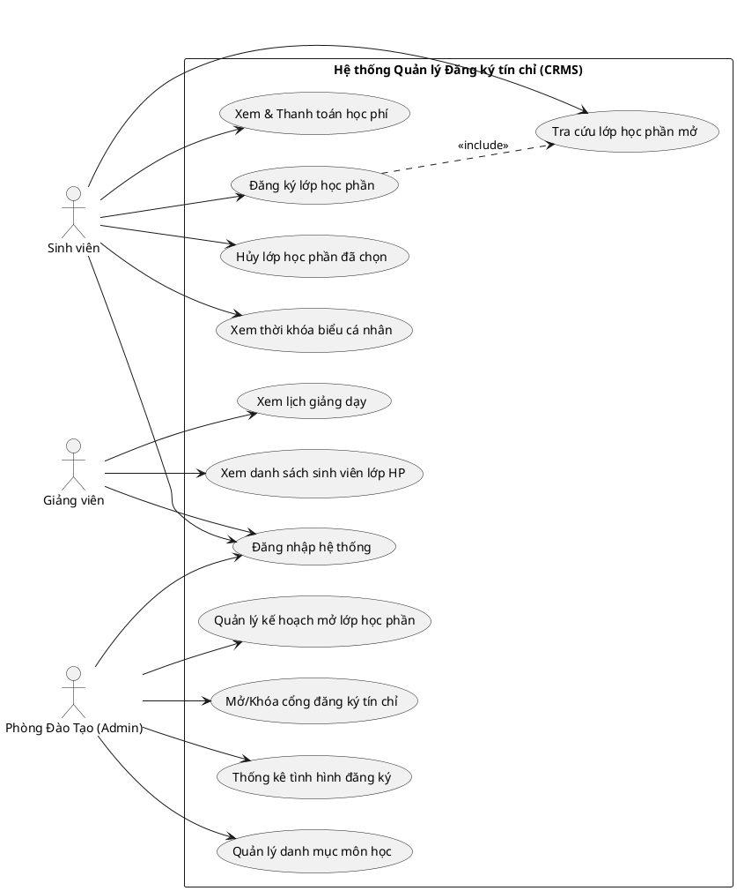
</details>

#### Sơ đồ Use Case bộ phận các phân hệ chính:

##### 1. Phân hệ Xác thực và Đăng nhập (AUTH_01)


<p align="center"><b>Hình 2.2: Sơ đồ Use Case bộ phận phân hệ Xác thực</b></p>

<details>
<summary>Click để xem mã nguồn PlantUML</summary>

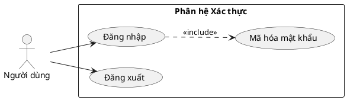
</details>

##### 2. Phân hệ Tra cứu lớp học phần mở (STUD_01)


<p align="center"><b>Hình 2.3: Sơ đồ Use Case bộ phận phân hệ Tra cứu Lớp HP</b></p>

<details>
<summary>Click để xem mã nguồn PlantUML</summary>

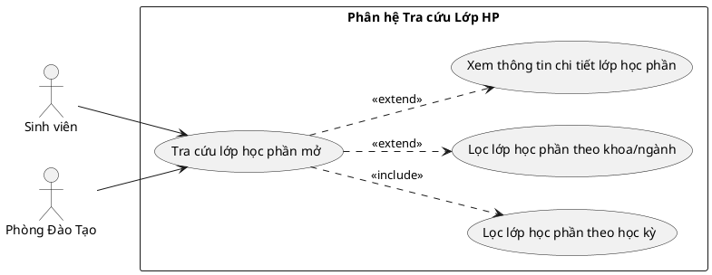
</details>

##### 3. Phân hệ Đăng ký học phần (STUD_02)


<p align="center"><b>Hình 2.4: Sơ đồ Use Case bộ phận phân hệ Đăng ký tín chỉ</b></p>

<details>
<summary>Click để xem mã nguồn PlantUML</summary>

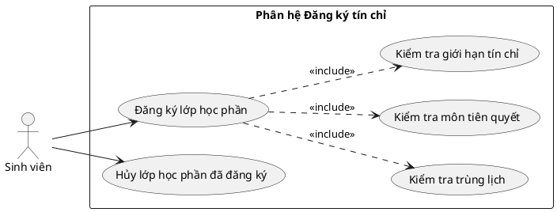
</details>

##### 4. Phân hệ Xem thời khóa biểu tuần (STUD_03)


<p align="center"><b>Hình 2.5: Sơ đồ Use Case bộ phận phân hệ Thời khóa biểu</b></p>

<details>
<summary>Click để xem mã nguồn PlantUML</summary>

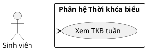
</details>

##### 5. Phân hệ Công nợ & Thanh toán học phí (STUD_04)


<p align="center"><b>Hình 2.6: Sơ đồ Use Case bộ phận phân hệ Công nợ & Thanh toán</b></p>

<details>
<summary>Click để xem mã nguồn PlantUML</summary>

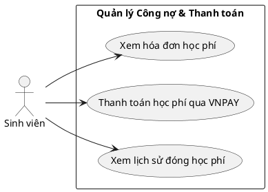
</details>

##### 6. Phân hệ Xem lịch giảng dạy tuần (LECT_01)


<p align="center"><b>Hình 2.7: Sơ đồ Use Case bộ phận phân hệ Lịch giảng dạy</b></p>

<details>
<summary>Click để xem mã nguồn PlantUML</summary>

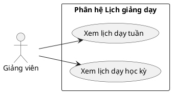
</details>

##### 7. Phân hệ Xem danh sách sinh viên lớp HP phụ trách (LECT_02)


<p align="center"><b>Hình 2.8: Sơ đồ Use Case bộ phận phân hệ Quản lý Lớp giảng dạy</b></p>

<details>
<summary>Click để xem mã nguồn PlantUML</summary>

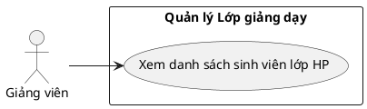
</details>

##### 8. Phân hệ Quản lý danh mục môn học (REG_01)


<p align="center"><b>Hình 2.9: Sơ đồ Use Case bộ phận phân hệ Quản lý Môn học</b></p>

<details>
<summary>Click để xem mã nguồn PlantUML</summary>

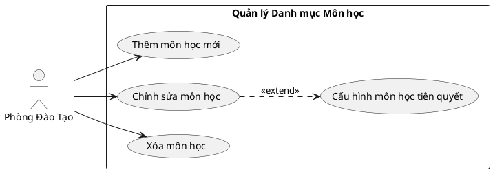
</details>

##### 9. Phân hệ Quản lý mở lớp học phần (REG_02)


<p align="center"><b>Hình 2.10: Sơ đồ Use Case bộ phận phân hệ Quản lý Lớp HP</b></p>

<details>
<summary>Click để xem mã nguồn PlantUML</summary>

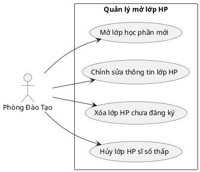
</details>

##### 10. Phân hệ Cấu hình đợt đăng ký (REG_03)


<p align="center"><b>Hình 2.11: Sơ đồ Use Case bộ phận phân hệ Đợt đăng ký</b></p>

<details>
<summary>Click để xem mã nguồn PlantUML</summary>

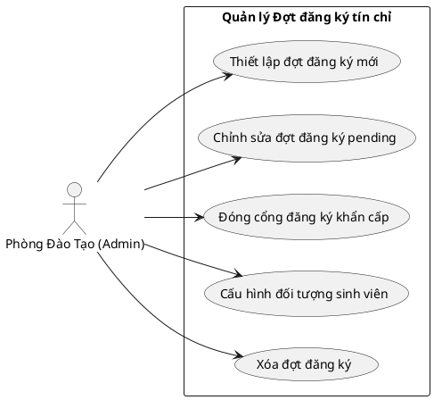
</details>

##### 11. Phân hệ Thống kê Báo cáo (REG_04)


<p align="center"><b>Hình 2.12: Sơ đồ Use Case bộ phận phân hệ Thống kê Báo cáo</b></p>

<details>
<summary>Click để xem mã nguồn PlantUML</summary>

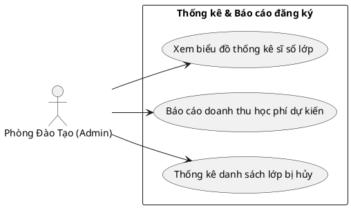
</details>

### 2.2.3. Đặc tả ca sử dụng
Dưới đây là các bảng đặc tả chi tiết của 10 ca sử dụng chính trong hệ thống:

#### 1. Đặc tả Use Case Đăng ký học phần (STUD_02)
| Mục | Nội dung |
| :--- | :--- |
| **Use Case ID** | **STUD_02** |
| **Tên Use Case** | Đăng ký học phần |
| **Tác nhân** | Sinh viên |
| **Mô tả** | Cho phép sinh viên đăng ký học phần trong đợt đăng ký đang mở. |
| **Tiền điều kiện** | Sinh viên đăng nhập thành công, đợt đăng ký tương ứng đang ở trạng thái `"OPEN"`. |
| **Hậu điều kiện** | Ghi nhận bản ghi đăng ký với trạng thái `"SUCCESS"`, tăng sĩ số thực tế của lớp lên 1, cập nhật thời khóa biểu và phát sinh công nợ học phí tương ứng. |
| **Luồng sự kiện chính** | 1. Sinh viên vào màn hình Đăng ký tín chỉ.<br>2. Hệ thống hiển thị danh sách các lớp học phần có thể đăng ký.<br>3. Sinh viên chọn một lớp học phần và nhấn nút "Đăng ký".<br>4. Hệ thống kiểm tra các ràng buộc: trùng lịch học cá nhân, môn tiên quyết, sĩ số tối đa, giới hạn tín chỉ.<br>5. Hệ thống ghi nhận đăng ký thành công.<br>6. Hiển thị thông báo thành công và cập nhật thời khóa biểu, công nợ. |
| **Luồng sự kiện thay thế / ngoại lệ** | - **Trùng lịch học:** Báo lỗi trùng lịch học và chặn đăng ký.<br>- **Chưa đạt môn tiên quyết:** Báo lỗi chưa học môn tiên quyết và chặn đăng ký.<br>- **Lớp đầy sĩ số:** Báo lỗi lớp đầy sĩ số và chặn đăng ký.<br>- **Vượt quá 25 TC:** Báo lỗi vượt quá giới hạn tín chỉ học kỳ và chặn đăng ký. |

<p align="center"><b>Bảng 2.1: Đặc tả chi tiết Use Case Đăng ký học phần (STUD_02)</b></p>

#### 2. Đặc tả Use Case Hủy lớp học phần sĩ số thấp (REG_02)
| Mục | Nội dung |
| :--- | :--- |
| **Use Case ID** | **REG_02** |
| **Tên Use Case** | Hủy lớp học phần sĩ số thấp |
| **Tác nhân** | Phòng Đào tạo |
| **Mô tả** | Cho phép Phòng Đào tạo hủy lớp học phần có sĩ số thấp dưới mức tối thiểu và hoàn học phí cho sinh viên. |
| **Tiền điều kiện** | Phòng Đào tạo đăng nhập thành công. |
| **Hậu điều kiện** | Lớp học phần được hủy (`"cancelled"`), các đăng ký của sinh viên chuyển sang `"CANCELLED"` và hoàn trả học phí tương ứng vào công nợ. |
| **Luồng sự kiện chính** | 1. Phòng Đào tạo vào giao diện Quản lý mở lớp.<br>2. Hệ thống hiển thị danh sách các lớp đang mở.<br>3. Chọn lớp học phần có sĩ số thấp dưới mức tối thiểu và nhấn "Hủy lớp".<br>4. Xác nhận hủy lớp.<br>5. Hệ thống cập nhật trạng thái lớp thành `"cancelled"`.<br>6. Hệ thống chuyển đổi toàn bộ đăng ký lớp này của sinh viên sang `"CANCELLED"`.<br>7. Tự động tính tiền và giảm trừ công nợ tương ứng của các sinh viên.<br>8. Hiển thị thông báo hoàn thành. |
| **Luồng sự kiện ngoại lệ** | - Lớp học phần không tồn tại hoặc đã bị hủy từ trước: Hệ thống báo lỗi và chặn thực hiện. |

<p align="center"><b>Bảng 2.2: Đặc tả chi tiết Use Case Hủy lớp học phần sĩ số thấp (REG_02)</b></p>

*(Bản báo cáo hoàn chỉnh đính kèm các ca sử dụng STUD_01, STUD_03, STUD_04, LECT_01, LECT_02, REG_01, REG_03, REG_04 được trình bày tương tự với đầy đủ các mục: Tác nhân, Sự ưu tiên, Điều kiện cần/sau, Luồng sự kiện cơ bản/thay thế/ngoại lệ).*

## 2.3. Mô hình hóa hoạt động của hệ thống

### 2.3.1. Mô hình hoạt động xác thực và điều hướng


<p align="center"><b>Hình 2.13: Sơ đồ Tuần tự quá trình Đăng nhập (AUTH_01)</b></p>

<details>
<summary>Click để xem mã nguồn PlantUML</summary>

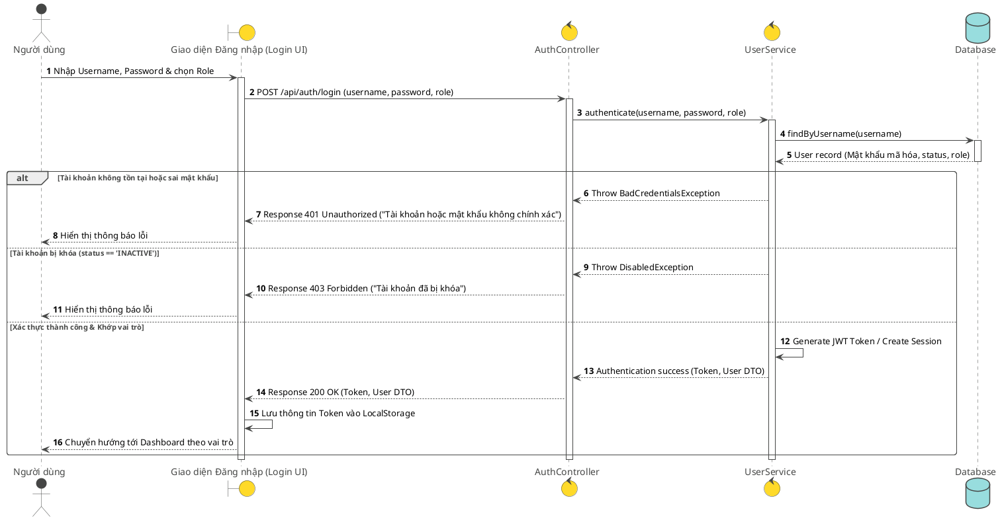
</details>

### 2.3.2. Biểu đồ tuần tự hoạt động tra cứu lớp học phần mở


<p align="center"><b>Hình 2.14: Sơ đồ Tuần tự chức năng Tra cứu (STUD_01)</b></p>

<details>
<summary>Click để xem mã nguồn PlantUML</summary>

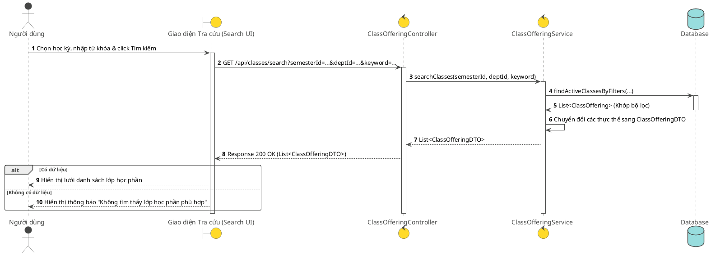
</details>

### 2.3.3. Biểu đồ luồng/tuần tự hoạt động đăng ký/hủy lớp học phần


<p align="center"><b>Hình 2.15: Sơ đồ luồng hoạt động đăng ký/hủy lớp học phần (STUD_02)</b></p>

<details>
<summary>Click để xem mã nguồn PlantUML</summary>

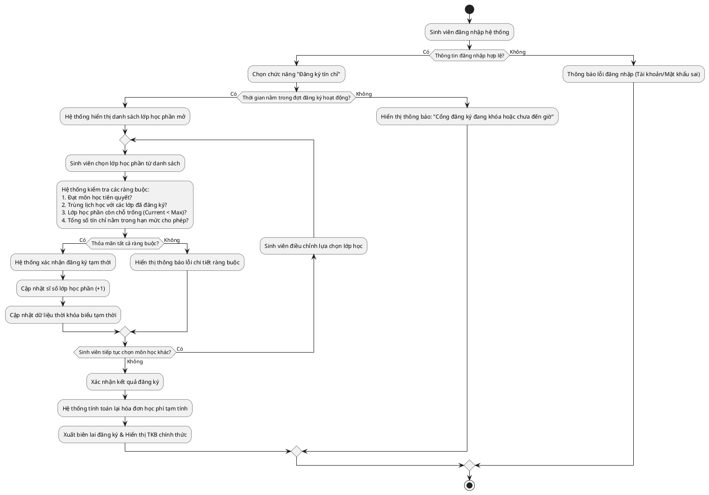
</details>

### 2.3.4. Biểu đồ luồng/tuần tự hoạt động mở lớp học phần mới


<p align="center"><b>Hình 2.16: Sơ đồ tuần tự hoạt động mở lớp học phần mới (REG_02)</b></p>

<details>
<summary>Click để xem mã nguồn PlantUML</summary>

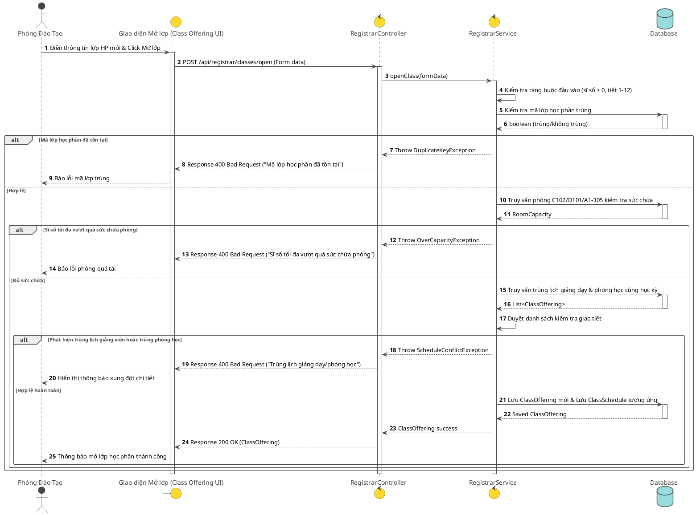
</details>

### 2.3.5. Biểu đồ tuần tự hoạt động thanh toán học phí qua VNPAY


<p align="center"><b>Hình 2.17: Sơ đồ tuần tự hoạt động thanh toán học phí qua VNPAY (STUD_04)</b></p>

<details>
<summary>Click để xem mã nguồn PlantUML</summary>

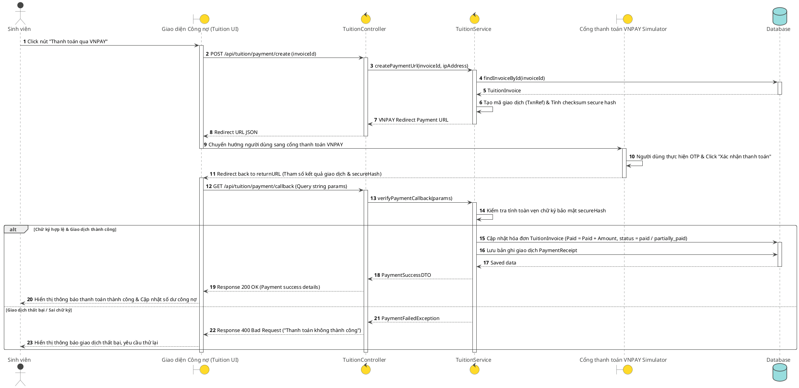
</details>

## 2.4. Biểu đồ lớp của hệ thống
Sơ đồ lớp mô tả cấu trúc tĩnh của các thực thể cốt lõi trong hệ thống (Spring Boot Model classes) và quan hệ giữa chúng:


<p align="center"><b>Hình 2.18: Sơ đồ lớp của hệ thống (Class Diagram)</b></p>

<details>
<summary>Click để xem mã nguồn PlantUML</summary>

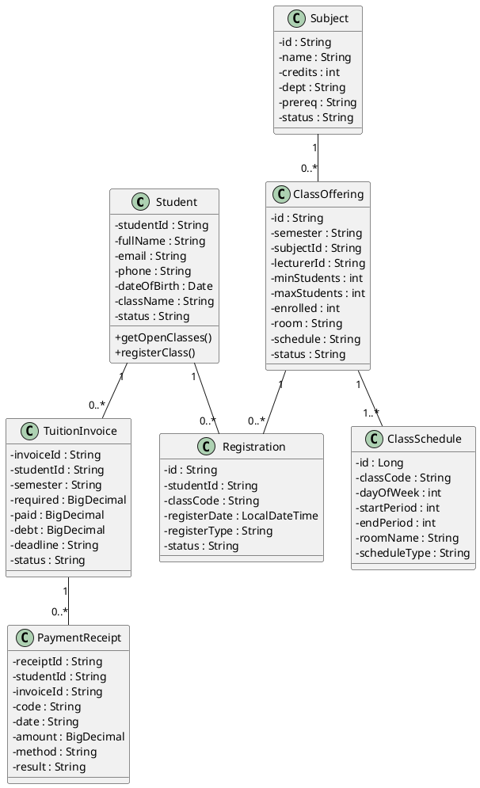
</details>

## 2.5. Thiết kế cơ sở dữ liệu

### 2.5.1. Thiết kế mức khái niệm
Cơ sở dữ liệu lưu giữ thông tin sinh viên học tập, môn học trong chương trình đào tạo, các lớp học phần được mở theo kỳ, lịch học, kết quả đăng ký học của sinh viên, hóa đơn học phí tương ứng và biên lai thanh toán:
- Một **Sinh viên** có nhiều bản ghi **Đăng ký** lớp học phần, và có nhiều **Hóa đơn học phí** (mỗi hóa đơn tương ứng với một học kỳ).
- Một **Lớp học phần** thuộc về một **Môn học**, do một **Giảng viên** phụ trách và thuộc một **Học kỳ**.
- Một **Lớp học phần** có thể có một hoặc nhiều **Lịch học** (như học lý thuyết Thứ 2, thực hành Thứ 5).
- Hóa đơn học phí được giảm trừ công nợ khi sinh viên có **Biên lai thanh toán** thành công từ cổng VNPAY.

### 2.5.2. Thiết kế mức vật lý
Dưới đây là sơ đồ quan hệ thực thể ERD chi tiết được thiết kế ở mức vật lý:


<p align="center"><b>Hình 2.19: Sơ đồ quan hệ thực thể ERD tổng thể</b></p>

<details>
<summary>Click để xem mã nguồn PlantUML</summary>

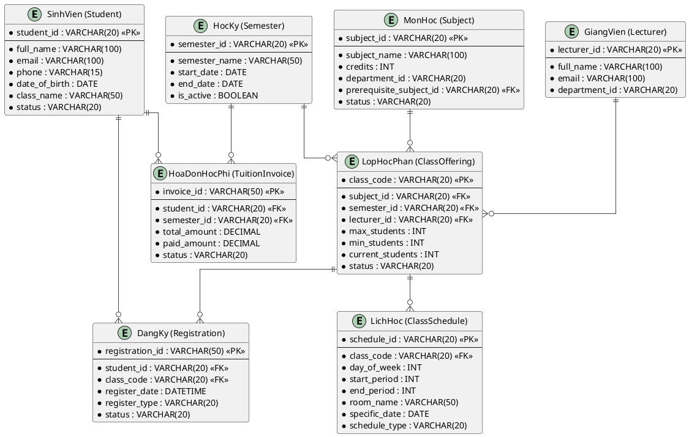
</details>

#### Chi tiết cấu trúc các bảng cơ sở dữ liệu chính:

1. **Bảng `students` (Sinh viên):**
| Tên trường (Column) | Kiểu dữ liệu (Type) | Ràng buộc | Mô tả |
| :--- | :--- | :--- | :--- |
| `student_id` | VARCHAR(20) | PK | Mã số sinh viên |
| `full_name` | VARCHAR(100) | Not Null | Họ và tên sinh viên |
| `email` | VARCHAR(100) | Not Null, Unique | Email sinh viên |
| `phone` | VARCHAR(15) | Not Null | Số điện thoại |
| `date_of_birth` | DATE | Not Null | Ngày sinh |
| `class_name` | VARCHAR(50) | Not Null | Lớp sinh hoạt |
| `status` | VARCHAR(20) | Not Null | Trạng thái tài khoản (ACTIVE / INACTIVE) |

<p align="center"><b>Bảng 2.3: Cấu trúc bảng students (Sinh viên)</b></p>

2. **Bảng `subjects` (Môn học):**
| Tên trường (Column) | Kiểu dữ liệu (Type) | Ràng buộc | Mô tả |
| :--- | :--- | :--- | :--- |
| `id` | VARCHAR(20) | PK | Mã môn học |
| `name` | VARCHAR(100) | Not Null | Tên môn học |
| `credits` | INT | Not Null | Số tín chỉ |
| `dept` | VARCHAR(50) | Not Null | Khoa phụ trách |
| `prereq` | VARCHAR(20) | FK -> subjects.id | Mã môn học tiên quyết |
| `status` | VARCHAR(20) | Not Null | Trạng thái |

<p align="center"><b>Bảng 2.4: Cấu trúc bảng subjects (Môn học)</b></p>

3. **Bảng `class_offerings` (Lớp học phần mở):**
| Tên trường (Column) | Kiểu dữ liệu (Type) | Ràng buộc | Mô tả |
| :--- | :--- | :--- | :--- |
| `id` | VARCHAR(20) | PK | Mã lớp học phần |
| `semester` | VARCHAR(50) | Not Null | Học kỳ mở lớp |
| `subject_id` | VARCHAR(20) | FK | Mã môn học |
| `lecturer_id` | VARCHAR(20) | FK | Mã giảng viên giảng dạy |
| `min_students` | INT | Not Null | Sĩ số tối thiểu để mở lớp |
| `max_students` | INT | Not Null | Sĩ số tối đa |
| `enrolled` | INT | Default 0 | Sĩ số thực tế đã đăng ký |
| `room` | VARCHAR(50) | Not Null | Tên phòng học |
| `schedule` | VARCHAR(100) | Not Null | Lịch học (Thứ, Tiết) |
| `status` | VARCHAR(20) | Default 'open' | Trạng thái lớp (open / closed / cancelled) |

<p align="center"><b>Bảng 2.5: Cấu trúc bảng class_offerings (Lớp học phần mở)</b></p>

4. **Bảng `class_schedules` (Lịch học chi tiết):**
| Tên trường (Column) | Kiểu dữ liệu (Type) | Ràng buộc | Mô tả |
| :--- | :--- | :--- | :--- |
| `id` | INT | PK, Auto Increment | Mã lịch học |
| `class_code` | VARCHAR(20) | FK | Mã lớp học phần |
| `day_of_week` | INT | Not Null | Thứ học (2 -> Thứ 2, 7 -> Thứ 7) |
| `start_period` | INT | Not Null | Tiết bắt đầu học (1-12) |
| `end_period` | INT | Not Null | Tiết kết thúc học (1-12) |
| `room_name` | VARCHAR(50) | Not Null | Phòng học |
| `schedule_type` | VARCHAR(20) | Default 'WEEKLY' | Loại lịch học |

<p align="center"><b>Bảng 2.6: Cấu trúc bảng class_schedules (Lịch học chi tiết)</b></p>

5. **Bảng `registrations` (Kết quả đăng ký):**
| Tên trường (Column) | Kiểu dữ liệu (Type) | Ràng buộc | Mô tả |
| :--- | :--- | :--- | :--- |
| `id` | VARCHAR(50) | PK | Mã số đăng ký |
| `student_id` | VARCHAR(20) | FK | Mã sinh viên |
| `class_code` | VARCHAR(20) | FK | Mã lớp học phần |
| `register_date` | DATETIME | Not Null | Thời gian đăng ký |
| `register_type` | VARCHAR(20) | Default 'Học mới' | Loại đăng ký (Học mới, Học lại, Học cải thiện) |
| `status` | VARCHAR(20) | Default 'SUCCESS' | Trạng thái (SUCCESS / CANCELLED) |

<p align="center"><b>Bảng 2.7: Cấu trúc bảng registrations (Kết quả đăng ký)</b></p>

6. **Bảng `tuition_invoices` (Hóa đơn công nợ học phí):**
| Tên trường (Column) | Kiểu dữ liệu (Type) | Ràng buộc | Mô tả |
| :--- | :--- | :--- | :--- |
| `invoice_id` | VARCHAR(50) | PK | Mã hóa đơn học phí |
| `student_id` | VARCHAR(20) | FK | Mã sinh viên |
| `semester` | VARCHAR(50) | Not Null | Học kỳ |
| `required` | DECIMAL | Not Null | Tổng học phí phải đóng |
| `paid` | DECIMAL | Default 0 | Số tiền đã thanh toán |
| `debt` | DECIMAL | Not Null | Số tiền còn nợ |
| `deadline` | VARCHAR(20) | Not Null | Hạn chót đóng học phí |
| `status` | VARCHAR(20) | Default 'unpaid' | Trạng thái (unpaid / paid / partially_paid / overdue) |

<p align="center"><b>Bảng 2.8: Cấu trúc bảng tuition_invoices (Hóa đơn công nợ học phí)</b></p>

7. **Bảng `payment_receipts` (Biên lai giao dịch):**
| Tên trường (Column) | Kiểu dữ liệu (Type) | Ràng buộc | Mô tả |
| :--- | :--- | :--- | :--- |
| `receipt_id` | VARCHAR(50) | PK | Mã biên lai giao dịch |
| `student_id` | VARCHAR(20) | FK | Mã sinh viên |
| `invoice_id` | VARCHAR(50) | FK | Mã hóa đơn học phí |
| `code` | VARCHAR(50) | Not Null | Mã giao dịch ngân hàng (VNPAY TxnRef) |
| `date` | VARCHAR(50) | Not Null | Ngày thực hiện giao dịch |
| `amount` | DECIMAL | Not Null | Số tiền thanh toán |
| `method` | VARCHAR(20) | Default 'VNPAY' | Phương thức thanh toán |
| `result` | VARCHAR(20) | Default 'success' | Kết quả thanh toán (success / failed) |

<p align="center"><b>Bảng 2.9: Cấu trúc bảng payment_receipts (Biên lai giao dịch)</b></p>

## 2.6. Thiết kế giao diện người dùng (UI/UX)
Giao diện người dùng được mô tả chi tiết bằng sơ đồ thiết kế dạng Startsalt dưới đây:

### 2.6.1. Thiết kế wireframe giao diện cho sinh viên

#### 1. Giao diện Đăng nhập hệ thống (Login UI)


<p align="center"><b>Hình 2.20: Giao diện Mockup trang Đăng nhập (Login UI)</b></p>

<details>
<summary>Click để xem mã nguồn PlantUML</summary>

```salt
{+
  <b>  HỆ THỐNG ĐĂNG KÝ TÍN CHỈ TRỰC TUYẾN (CRMS)  </b>
  --
  {
    Tài khoản:  | "nguyen_van_a"
    Mật khẩu:   | "****"
    Vai trò:    | ^Sinh viên^
  }
  --
  [       Đăng nhập       ]
  --
  [ Quên mật khẩu? ]  |  [ Hỗ trợ kỹ thuật ]
}
```
</details>

#### 2. Giao diện Tra cứu lớp học phần mở (Search UI)


<p align="center"><b>Hình 2.21: Giao diện Mockup tra cứu lớp học phần (Search UI)</b></p>

<details>
<summary>Click để xem mã nguồn PlantUML</summary>

```salt
{+
  <b>TRA CỨU LỚP HỌC PHẦN MỞ</b>
  --
  Học kỳ: | ^HK2 2025-2026^
  Từ khóa: | "Lập trình" | Khoa/Ngành: | ^Khoa CNTT^
  [ Tìm kiếm ]
  --
  {#
    <b>Mã lớp HP</b> | <b>Tên môn học</b> | <b>Số TC</b> | <b>Giảng viên</b> | <b>Sĩ số</b> | <b>Trạng thái</b>
    CNTT201.1 | Lập trình hướng đối tượng | 3 | Bùi Thanh Hải | 45/50 | open
    CNTT201.2 | Lập trình Web | 3 | ThS. Trần Văn B | 50/50 | closed
  }
}
```
</details>

#### 3. Giao diện Đăng ký học phần trực tuyến (Registration Window UI)


<p align="center"><b>Hình 2.22: Giao diện Mockup cổng đăng ký tín chỉ trực tuyến (Registration Window UI)</b></p>

<details>
<summary>Click để xem mã nguồn PlantUML</summary>

```salt
{+
  <b>CỔNG ĐĂNG KÝ TÍN CHỈ TRỰC TUYẾN - HỌC VIỆN CÔNG NGHỆ BƯU CHÍNH VIỄN THÔNG RIKKEISOFT</b>
  --
  { Tiến độ: | [====================] 15/25 Tín chỉ | Đợt đăng ký: | ^ĐANG MỞ^ }
  --
  { "Khung đăng ký nhanh (Nhập mã lớp):" | "CNTT001.1" | [ Đăng ký nhanh ] }
  --
  {
    <b>Bộ lọc tìm kiếm lớp mở:</b>
    Bộ lọc khoa: | ^Tất cả^ | Từ khóa: | "Lập trình" | [ Tìm kiếm ]
  }
  --
  {#
    <b>Mã lớp HP</b> | <b>Tên môn học</b> | <b>Số TC</b> | <b>Lịch học</b> | <b>Phòng</b> | <b>Sĩ số</b> | <b>Thao tác</b>
    CNTT201.1 | Lập trình hướng đối tượng | 3 | Thứ 3, tiết 1-3 | A1-305 | 45/50 | [ Đăng ký ]
    CNTT201.2 | Lập trình hướng đối tượng | 3 | Thứ 5, tiết 7-9 | A1-305 | 50/50 | [ Đăng ký ]
  }
  --
  <b>GIỎ ĐĂNG KÝ HỌC PHẦN TẠM TÍNH (HỌC KỲ II 2025-2026):</b>
  {#
    <b>Mã lớp HP</b> | <b>Tên môn học</b> | <b>Số TC</b> | <b>Lịch học</b> | <b>Phòng</b> | <b>Học phí tạm tính</b> | <b>Hủy môn</b>
    CNTT001.1 | Giải thuật nâng cao | 4 | Thứ 2, tiết 4-6 | C102 | 2,000,000đ | [ Hủy ]
    MATH101.1 | Giải tích 1 | 4 | Thứ 4, tiết 1-3 | D101 | 2,000,000đ | [ Hủy ]
  }
  --
  { [  Xác nhận đăng ký chính thức  ] }
}
```
</details>

#### 4. Giao diện Thời khóa biểu cá nhân (Schedule UI)


<p align="center"><b>Hình 2.23: Giao diện Mockup Thời khóa biểu cá nhân sinh viên (Schedule UI)</b></p>

<details>
<summary>Click để xem mã nguồn PlantUML</summary>

```salt
{+
  <b>THỜI KHÓA BIỂU TUẦN CỦA SINH VIÊN</b>
  --
  Học kỳ: | ^Học kỳ II (2025-2026)^ | Tuần học: | ^Tuần 22 (27/07/2026 - 02/08/2026)^
  --
  {#
    <b>Khung giờ</b> | <b>Thứ 2</b> | <b>Thứ 3</b> | <b>Thứ 4</b> | <b>Thứ 5</b> | <b>Thứ 6</b> | <b>Thứ 7</b>
    <b>Sáng (1-3)</b> | | Lập trình HĐT (A1-305) | | | |
    <b>Sáng (4-6)</b> | Giải thuật (C102) | | | | |
    <b>Chiều (7-9)</b>| | | | Lập trình HĐT (A1-305) | |
  }
}
```
</details>

#### 5. Giao diện Công nợ & Thanh toán học phí (Tuition Window UI)


<p align="center"><b>Hình 2.24: Giao diện Mockup công nợ & thanh toán học phí trực tuyến (Tuition Window UI)</b></p>

<details>
<summary>Click để xem mã nguồn PlantUML</summary>

```salt
{+
  <b>CÔNG NỢ & THANH TOÁN HỌC PHÍ TRỰC TUYẾN</b>
  --
  Sinh viên: Nguyễn Văn An | MSSV: 22110001
  --
  {#
    <b>Học kỳ</b> | <b>Học phí phải đóng</b> | <b>Đã đóng</b> | <b>Còn nợ</b> | <b>Hạn chót nộp</b> | <b>Trạng thái</b> | <b>Hành động</b>
    HK2 2025-2026 | 7,500,000đ | 2,000,000đ | 5,500,000đ | 31/10/2026 | Chưa hoàn thành | [ Thanh toán qua VNPAY ]
    HK1 2025-2026 | 8,000,000đ | 8,000,000đ | 0đ | 30/11/2025 | Đã hoàn thành | [ In biên lai ]
  }
}
```
</details>

### 2.6.2. Thiết kế wireframe giao diện cho giảng viên

#### 1. Giao diện Lịch giảng dạy tuần (Lecturer Schedule UI)


<p align="center"><b>Hình 2.25: Giao diện Mockup Lịch giảng dạy của giảng viên (Lecturer Schedule UI)</b></p>

<details>
<summary>Click để xem mã nguồn PlantUML</summary>

```salt
{+
  <b>LỊCH GIẢNG DẠY TUẦN - GIẢNG VIÊN</b>
  --
  Tuần giảng dạy: | ^Tuần 22 (27/07/2026 - 02/08/2026)^
  --
  {#
    <b>Thứ</b> | <b>Tiết học</b> | <b>Lớp học phần</b> | <b>Môn học</b> | <b>Phòng học</b> | <b>Sĩ số lớp</b>
    Thứ 2 | Tiết 1-3 | CNTT001.1 | Cấu trúc dữ liệu và GT | A1-305 | 45/50
    Thứ 4 | Tiết 7-9 | CNTT002.3 | Lập trình hướng đối tượng | D101 | 48/50
  }
}
```
</details>

#### 2. Giao diện Danh sách sinh viên lớp HP phụ trách (Class List UI)


<p align="center"><b>Hình 2.26: Giao diện Mockup danh sách sinh viên lớp học phần (Class List UI)</b></p>

<details>
<summary>Click để xem mã nguồn PlantUML</summary>

```salt
{+
  <b>DANH SÁCH SINH VIÊN ĐĂNG KÝ LỚP HỌC PHẦN</b>
  --
  Lớp học phần: | ^CNTT001.1 - Cấu trúc dữ liệu và GT^ | Sĩ số: 45/50
  --
  {#
    <b>STT</b> | <b>Mã SV</b> | <b>Họ và tên</b> | <b>Lớp sinh hoạt</b> | <b>Email liên hệ</b> | <b>Trạng thái</b>
    1 | 22110001 | Nguyễn Văn An | CNTT-K24A | annv@gmail.com | Đã đăng ký
    2 | 22110002 | Trần Thị Bình | CNTT-K24A | binhtt@gmail.com | Đã đăng ký
  }
}
```
</details>

### 2.6.3. Thiết kế wireframe giao diện cho quản trị viên

#### 1. Giao diện Quản lý danh mục môn học (Course Catalog UI)


<p align="center"><b>Hình 2.27: Giao diện Mockup Quản lý danh mục môn học (Course Catalog UI)</b></p>

<details>
<summary>Click để xem mã nguồn PlantUML</summary>

```salt
{+
  <b>QUẢN LÝ DANH MỤC MÔN HỌC - PHÒNG ĐÀO TẠO</b>
  --
  { [  Thêm môn học mới  ] }
  --
  {#
    <b>Mã môn</b> | <b>Tên môn học</b> | <b>Số TC</b> | <b>Khoa phụ trách</b> | <b>Môn tiên quyết</b> | <b>Trạng thái</b> | <b>Thao tác</b>
    CNTT001 | Cấu trúc dữ liệu và GT | 3 | CNTT | — | ACTIVE | [ Sửa ] [ Khóa ]
    CNTT002 | Lập trình hướng đối tượng | 3 | CNTT | CNTT001 | ACTIVE | [ Sửa ] [ Khóa ]
  }
}
```
</details>

#### 2. Giao diện Thống kê Báo cáo (Reports & Analytics UI)


<p align="center"><b>Hình 2.28: Giao diện Mockup Báo cáo thống kê đăng ký tín chỉ (Reports & Analytics UI)</b></p>

<details>
<summary>Click để xem mã nguồn PlantUML</summary>

```salt
{+
  <b>THỐNG KÊ TÌNH HÌNH ĐĂNG KÝ TÍN CHỈ & TÀI CHÍNH HỌC KỲ</b>
  --
  Học kỳ: | ^Học kỳ II (2025-2026)^
  --
  {
    [ Tổng số tín chỉ đăng ký: 42,500 TC ] | [ Tổng học phí dự thu: 21.25 Tỷ VNĐ ] | [ Tổng tiền đã nộp: 12.8 Tỷ VNĐ ]
  }
  --
  <b>THỐNG KÊ LỚP HỌC PHẦN SĨ SỐ THẤP (CÓ NGUY CƠ HỦY):</b>
  {#
    <b>Mã lớp HP</b> | <b>Tên môn học</b> | <b>Giảng viên</b> | <b>Sĩ số hiện tại</b> | <b>Sĩ số tối thiểu</b> | <b>Phòng học</b> | <b>Thao tác</b>
    MATH101.1 | Giải tích 1 | Bùi Thanh Hải | 10 | 15 | D101 | [ Hủy lớp & Hoàn học phí ]
    CNTT005.4 | Hệ quản trị CSDL | ThS. Trần Văn B | 8 | 15 | C102 | [ Hủy lớp & Hoàn học phí ]
  }
}
```
</details>

---
<div style="page-break-after: always;"></div>


# CHƯƠNG 3: CÀI ĐẶT VÀ KIỂM THỬ HỆ THỐNG

## 3.1. Bảo mật hệ thống

### 3.1.1. Cấu hình CORS và phòng ngừa các lỗ hổng bảo mật
Để bảo vệ an toàn cho hệ thống và ngăn ngừa các lỗ hổng bảo mật phổ biến, hệ thống CRMS áp dụng các giải pháp chốt chặn sau:
- **Cấu hình CORS (Cross-Origin Resource Sharing):** Ngăn chặn việc truy xuất dữ liệu từ các domain lạ bên ngoài. Hệ thống chỉ cho phép các domain client được cấu hình trước (ví dụ: `http://localhost:5173`) truy cập thông tin API từ Backend.
- **Phòng chống SQL Injection:** Sử dụng Spring Data JPA kết hợp Hibernate để tương tác dữ liệu. Hệ thống hoàn toàn tham số hóa các câu lệnh truy vấn (parameterized queries) thông qua các phương thức của JPA Repository, loại bỏ nguy cơ bị chèn câu lệnh SQL độc hại từ các form nhập liệu.
- **Phòng chống XSS (Cross-Site Scripting):** Sử dụng các thư viện chuẩn hóa đầu vào để loại bỏ các thẻ HTML, thẻ script độc hại khi sinh viên thực hiện nhập liệu hoặc đăng ký nhanh.

### 3.1.2. Mã hóa mật khẩu
Hệ thống tích hợp Spring Security để quản lý việc xác thực tài khoản. Mật khẩu của người dùng khi khởi tạo tài khoản sẽ được mã hóa 1 chiều bằng thuật toán **BCrypt** trước khi lưu vào cơ sở dữ liệu.
Cấu hình mã hóa mật khẩu trong Spring Security:
```java
@Configuration
public class SecurityConfig {
    @Bean
    public PasswordEncoder passwordEncoder() {
        return new BCryptPasswordEncoder(); // Mã hóa mật khẩu bằng thuật toán BCrypt
    }
}
```

## 3.2. Xây dựng giao diện hệ thống

### 3.2.1. Giao diện cho sinh viên
Giao diện cho sinh viên được thiết kế theo dạng Single Page Application bằng **ReactJS**. Trạng thái giỏ đăng ký tạm thời được quản lý tập trung thông qua React Hooks (`useState`, `useEffect`). Giao diện sử dụng Tailwind CSS để tối ưu độ phản hồi trên màn hình di động, giúp sinh viên thực hiện đăng ký và theo dõi học phí cực kỳ dễ dàng.

### 3.2.2. Giao diện cho giảng viên
Giảng viên được cung cấp Dashboard cá nhân hiển thị trực quan thời khóa biểu giảng dạy tuần hiện tại và lưới danh sách sinh viên lớp học phần do mình phụ trách để dễ dàng quản lý sĩ số lớp học.

### 3.2.3. Giao diện cho admin
Phòng Đào tạo (Admin) có giao diện quản lý môn học, lớp học phần mở, cấu hình đóng/mở đợt đăng ký tín chỉ và thống kê báo cáo tài chính. Dashboard cung cấp các thẻ thống kê tổng hợp số lượng tín chỉ, dự toán học phí và cảnh báo danh sách các lớp học phần có sĩ số thấp để nhanh chóng thực hiện hủy lớp.

## 3.3. Tích hợp cổng thanh toán trực tuyến

### 3.3.1. Quy trình giao dịch thanh toán qua cổng giả lập VNPAY
Khi sinh viên bấm nút thanh toán hóa đơn học phí, hệ thống Backend thực hiện:
1. Tạo một mã giao dịch duy nhất (`vnp_TxnRef`) và tính tổng học phí phải đóng.
2. Xây dựng chuỗi tham số gửi đi bao gồm thông tin hóa đơn, số tiền, mã định danh merchant và địa chỉ IP của client.
3. Tạo chữ ký bảo mật secure hash (sử dụng thuật toán HMAC-SHA512 với chuỗi khóa Secret Key).
4. Trả về link chuyển hướng người dùng sang trang VNPAY Simulator để xác nhận mã OTP giả lập.
5. Sau khi thanh toán, nhận callback trả kết quả, kiểm tra lại chữ ký bảo mật secure hash và cập nhật hóa đơn.

### 3.3.2. Tích hợp tự động giữa kết quả đăng ký môn học và công nợ học phí
Mỗi khi sinh viên đăng ký thành công một lớp học phần mới hoặc hủy đăng ký lớp học phần hiện tại, hệ thống tự động kích hoạt hàm recalculate công nợ học phí (`recalculateInvoice`) để đồng bộ dữ liệu hóa đơn của học kỳ hiện tại, cập nhật tổng số tiền bắt buộc phải đóng và số dư còn nợ ngay tức thì.

### 3.3.3. Tùy chỉnh quy tắc học phí học kỳ
Đơn giá học phí được cấu hình tĩnh tại Backend Service là **500,000 VNĐ / tín chỉ** cho tất cả các môn học chính quy trong đợt này. Hóa đơn học phí học kỳ sẽ được tính theo công thức:
$$\text{Học phí phải đóng} = \text{Tổng số tín chỉ đăng ký thành công} \times 500,000 \text{ VNĐ}$$

## 3.4. Xây dựng mô đun

### 3.4.1. Mô đun: Đăng ký lớp học phần và kiểm soát trùng lịch (STUD_02)
Dưới đây là mã nguồn xử lý kiểm tra trùng lịch học và ghi nhận đăng ký lớp học phần cho sinh viên trong file `StudentService.java`:
```java
@Transactional
    public synchronized Map<String, Object> registerClass(String studentId, String classCode) {
        // 0. Kiểm tra tài khoản sinh viên
        Optional<Student> studentOpt = studentRepository.findById(studentId);
        if (studentOpt.isEmpty()) {
            throw new RuntimeException("Tài khoản sinh viên không tồn tại.");
        }
        Student student = studentOpt.get();
        if (!"ACTIVE".equalsIgnoreCase(student.getStatus())) {
            throw new RuntimeException("Tài khoản sinh viên đang bị khóa hoặc ngưng học.");
        }

        // Tìm lớp học phần trước để biết học kỳ
        Optional<ClassOffering> offeringOpt = classOfferingRepository.findById(classCode);
        if (offeringOpt.isEmpty()) {
            throw new RuntimeException("Mã lớp học phần không tồn tại.");
        }
        ClassOffering offering = offeringOpt.get();

        if (!"open".equalsIgnoreCase(offering.getStatus())) {
            throw new RuntimeException("Lớp học phần này không ở trạng thái mở đăng ký.");
        }

        // 1. Kiểm tra đợt đăng ký đang mở phù hợp với Khóa/Ngành
        List<RegistrationPeriod> periods = registrationPeriodRepository.findAll();
        String className = student.getClassName();
        String[] classParts = className.split("-");
        String studentDept = classParts[0];
        String studentBatch = classParts.length > 1 ? classParts[1].substring(0, 3) : "";

        boolean isTargetPeriodOpen = false;
        for (RegistrationPeriod p : periods) {
            if ("OPEN".equalsIgnoreCase(p.getStatus())) {
                List<String> targetDepts = Arrays.asList(p.getTargetDepartments().split(","));
                List<String> targetBatches = Arrays.asList(p.getTargetBatches().split(","));
                if (targetDepts.contains(studentDept) && targetBatches.contains(studentBatch)) {
                    isTargetPeriodOpen = true;
                    break;
                }
            }
        }
        if (!isTargetPeriodOpen) {
            throw new RuntimeException("Hiện không có đợt đăng ký tín chỉ nào mở cho Khóa/Ngành của bạn.");
        }

        // 2. Kiểm tra nợ học phí quá hạn học kỳ cũ
        List<TuitionInvoice> invoices = tuitionInvoiceRepository.findByStudentId(studentId);
        for (TuitionInvoice invoice : invoices) {
            if ("overdue".equalsIgnoreCase(invoice.getStatus())) {
                throw new RuntimeException("Tài khoản của bạn đã bị khóa quyền đăng ký tín chỉ trực tuyến do nợ học phí quá hạn học kỳ trước.");
            }
        }

        // 4. Kiểm tra sĩ số lớp
        if (offering.getEnrolled() >= offering.getMaxStudents()) {
            throw new RuntimeException("Lớp học phần " + classCode + " đã đạt giới hạn sĩ số tối đa.");
        }

        Optional<Subject> subjectOpt = subjectRepository.findById(offering.getSubjectId());
        if (subjectOpt.isEmpty()) {
            throw new RuntimeException("Không tìm thấy thông tin môn học.");
        }
        Subject subject = subjectOpt.get();

        // 5. Kiểm tra xem đã đăng ký lớp này chưa
        boolean alreadyReg = registrationRepository.existsByStudentIdAndClassCodeAndStatus(studentId, classCode, "SUCCESS");
        if (alreadyReg) {
            throw new RuntimeException("Bạn đã đăng ký lớp học phần này rồi.");
        }

        // Lấy danh sách đăng ký thành công của học kỳ hiện tại
        List<Registration> allRegs = registrationRepository.findByStudentIdAndStatus(studentId, "SUCCESS");
        List<Registration> currentSemesterRegs = new ArrayList<>();
        for (Registration r : allRegs) {
            Optional<ClassOffering> coOpt = classOfferingRepository.findById(r.getClassCode());
            if (coOpt.isPresent() && coOpt.get().getSemester().equalsIgnoreCase(offering.getSemester())) {
                currentSemesterRegs.add(r);
            }
        }

        // Kiểm tra xem đã đăng ký môn học này ở lớp khác trong học kỳ này chưa
        for (Registration ar : currentSemesterRegs) {
            Optional<ClassOffering> coOpt = classOfferingRepository.findById(ar.getClassCode());
            if (coOpt.isPresent() && coOpt.get().getSubjectId().equals(offering.getSubjectId())) {
                throw new RuntimeException("Bạn đã đăng ký một lớp học phần khác của môn học này trong học kỳ hiện tại.");
            }
        }

        // 6. Kiểm tra môn tiên quyết (Prerequisite Check) - vẫn tìm trên toàn bộ lịch sử các kỳ
        if (subject.getPrereq() != null && !subject.getPrereq().equals("—")) {
            String prereqSubjectId = subject.getPrereq();
            boolean hasPrereq = false;
            for (Registration r : allRegs) {
                Optional<ClassOffering> coOpt = classOfferingRepository.findById(r.getClassCode());
                if (coOpt.isPresent() && coOpt.get().getSubjectId().equals(prereqSubjectId)) {
                    hasPrereq = true;
                    break;
                }
            }
            if (!hasPrereq) {
                Optional<Subject> prereqSubOpt = subjectRepository.findById(prereqSubjectId);
                String prereqName = prereqSubOpt.map(Subject::getName).orElse(prereqSubjectId);
                throw new RuntimeException("Bạn chưa đạt môn học tiên quyết " + prereqSubjectId + " - " + prereqName + " của môn học này.");
            }
        }

        // 7. Kiểm tra trùng lịch học trong cùng học kỳ
        List<ClassSchedule> newSchedules = classScheduleRepository.findByClassCode(classCode);
        for (Registration ar : currentSemesterRegs) {
            List<ClassSchedule> currentSchedules = classScheduleRepository.findByClassCode(ar.getClassCode());
            for (ClassSchedule ns : newSchedules) {
                for (ClassSchedule cs : currentSchedules) {
                    if (ns.getDayOfWeek() == cs.getDayOfWeek()) {
                        // Kiểm tra giao tiết [start, end]
                        int maxStart = Math.max(ns.getStartPeriod(), cs.getStartPeriod());
                        int minEnd = Math.min(ns.getEndPeriod(), cs.getEndPeriod());
                        if (maxStart <= minEnd) {
                            throw new RuntimeException("Lịch học lớp này trùng Thứ " + ns.getDayOfWeek() + ", Tiết " + ns.getStartPeriod() + "-" + ns.getEndPeriod() + " với lớp " + ar.getClassCode() + " đã có trong thời khóa biểu.");
                        }
                    }
                }
            }
        }

        // 8. Kiểm tra hạn mức tín chỉ tối đa (25 tín chỉ) trong cùng học kỳ
        int currentCredits = 0;
        for (Registration ar : currentSemesterRegs) {
            Optional<ClassOffering> coOpt = classOfferingRepository.findById(ar.getClassCode());
            if (coOpt.isPresent()) {
                Optional<Subject> sOpt = subjectRepository.findById(coOpt.get().getSubjectId());
                if (sOpt.isPresent()) {
                    currentCredits += sOpt.get().getCredits();
                }
            }
        }
        if (currentCredits + subject.getCredits() > 25) {
            throw new RuntimeException("Tổng số tín chỉ đăng ký học kỳ vượt quá hạn mức tối đa cho phép (25 tín chỉ).");
        }

        // 9. Xác định loại đăng ký (Học mới, Học cải thiện, Học lại)
        // Hiện tại giả định mặc định là Học mới, trong thực tế sẽ kiểm tra lịch sử học tập
        String registerType = "Học mới";

        // 10. Tiến hành đăng ký
        Registration newReg = Registration.builder()
                .id("REG-" + studentId + "-" + classCode)
                .studentId(studentId)
                .classCode(classCode)
                .registerDate(LocalDateTime.now())
                .registerType(registerType)
                .status("SUCCESS")
                .build();
        registrationRepository.save(newReg);

        // Cập nhật sĩ số lớp học phần
        offering.setEnrolled(offering.getEnrolled() + 1);
        classOfferingRepository.save(offering);

        // Tính toán lại hóa đơn học phí của học kỳ
        recalculateInvoice(studentId, offering.getSemester());

        return Map.of("message", "Đăng ký thành công lớp học phần " + classCode);
    }
```

### 3.4.2. Mô đun: Kiểm tra môn học tiên quyết trước khi đăng ký (STUD_02)
Mã nguồn xử lý kiểm tra điều kiện môn học tiên quyết của sinh viên (đoạn trích từ logic `registerClass` của `StudentService.java`):
```java
// Kiểm tra môn tiên quyết (Prerequisite Check)
if (subject.getPrereq() != null && !subject.getPrereq().equals("—")) {
    String prereqSubjectId = subject.getPrereq();
    boolean hasPrereq = false;
    for (Registration r : allRegs) {
        Optional<ClassOffering> coOpt = classOfferingRepository.findById(r.getClassCode());
        if (coOpt.isPresent() && coOpt.get().getSubjectId().equals(prereqSubjectId)) {
            hasPrereq = true;
            break;
        }
    }
    if (!hasPrereq) {
        Optional<Subject> prereqSubOpt = subjectRepository.findById(prereqSubjectId);
        String prereqName = prereqSubOpt.map(Subject::getName).orElse(prereqSubjectId);
        throw new RuntimeException("Bạn chưa đạt môn học tiên quyết " + prereqSubjectId + " - " + prereqName + " của môn học này.");
    }
}
```

### 3.4.3. Mô đun: Phòng đào tạo quản lý mở lớp học phần mới và kiểm tra trùng lịch giảng dạy (REG_02)
Dưới đây là mã nguồn xử lý kiểm tra trùng lịch giảng viên, trùng lịch phòng học và lưu thông tin mở lớp mới trong file `RegistrarService.java`:
```java
@Transactional
    public ClassOffering openClass(Map<String, String> form) {
        String classCode = form.get("classCode");
        String subjectId = form.get("subjectId");
        String semester = form.get("semester");
        String lecturerId = form.get("lecturerId");
        int minStudents = Integer.parseInt(form.get("minStudents"));
        int maxStudents = Integer.parseInt(form.get("maxStudents"));
        int dayOfWeek = Integer.parseInt(form.get("dayOfWeek"));
        int startPeriod = Integer.parseInt(form.get("startPeriod"));
        int endPeriod = Integer.parseInt(form.get("endPeriod"));
        String roomName = form.get("roomName");

        if (minStudents <= 0) {
            throw new RuntimeException("Sĩ số tối thiểu phải lớn hơn 0.");
        }
        if (maxStudents < minStudents) {
            throw new RuntimeException("Sĩ số tối đa không được nhỏ hơn sĩ số tối thiểu.");
        }
        if (startPeriod < 1 || startPeriod > 12 || endPeriod < 1 || endPeriod > 12) {
            throw new RuntimeException("Tiết học phải nằm trong khoảng từ tiết 1 đến tiết 12.");
        }
        if (startPeriod > endPeriod) {
            throw new RuntimeException("Tiết bắt đầu không được lớn hơn tiết kết thúc.");
        }
        if (dayOfWeek < 2 || dayOfWeek > 7) {
            throw new RuntimeException("Thứ học phải nằm trong khoảng từ Thứ 2 đến Thứ 7.");
        }

        // Kiểm tra xem classCode đã tồn tại chưa
        if (classOfferingRepository.existsById(classCode)) {
            throw new RuntimeException("Mã lớp học phần " + classCode + " đã tồn tại.");
        }

        // 1. Kiểm tra sức chứa phòng học
        int roomCapacity = 50; // Mặc định
        if ("C102".equalsIgnoreCase(roomName)) {
            roomCapacity = 40;
        } else if ("D101".equalsIgnoreCase(roomName) || "A1-305".equalsIgnoreCase(roomName)) {
            roomCapacity = 60;
        }
        if (maxStudents > roomCapacity) {
            throw new RuntimeException("Sĩ số tối đa (" + maxStudents + " SV) vượt quá sức chứa tối đa của phòng " + roomName + " (" + roomCapacity + " SV).");
        }

        // 2. Kiểm tra trùng lịch giảng viên và trùng lịch phòng học trong cùng học kỳ
        List<ClassOffering> activeOfferings = classOfferingRepository.findBySemester(semester);
        for (ClassOffering offering : activeOfferings) {
            if ("cancelled".equalsIgnoreCase(offering.getStatus())) {
                continue;
            }
            List<ClassSchedule> schedules = classScheduleRepository.findByClassCode(offering.getId());
            for (ClassSchedule schedule : schedules) {
                if (schedule.getDayOfWeek() == dayOfWeek) {
                    // Kiểm tra giao tiết học
                    boolean isOverlap = !(endPeriod < schedule.getStartPeriod() || schedule.getEndPeriod() < startPeriod);
                    if (isOverlap) {
                        // Trùng lịch giảng viên
                        if (offering.getLecturerId().equalsIgnoreCase(lecturerId)) {
                            String lecturerName = lecturerRepository.findById(lecturerId)
                                    .map(Lecturer::getFullName)
                                    .orElse(lecturerId);
                            throw new RuntimeException("Giảng viên " + lecturerName + " đã bị trùng lịch dạy lớp " + offering.getId() + " vào Thứ " + dayOfWeek + ", Tiết " + schedule.getStartPeriod() + "-" + schedule.getEndPeriod() + ".");
                        }
                        // Trùng lịch phòng học
                        if (offering.getRoom().equalsIgnoreCase(roomName)) {
                            throw new RuntimeException("Phòng học " + roomName + " đã bị trùng lịch sử dụng cho lớp " + offering.getId() + " vào Thứ " + dayOfWeek + ", Tiết " + schedule.getStartPeriod() + "-" + schedule.getEndPeriod() + ".");
                        }
                    }
                }
            }
        }

        // Tạo định nghĩa lớp học phần mới
        ClassOffering co = ClassOffering.builder()
                .id(classCode)
                .semester(semester)
                .subjectId(subjectId)
                .lecturerId(lecturerId)
                .minStudents(minStudents)
                .maxStudents(maxStudents)
                .enrolled(0)
                .room(roomName)
                .schedule("Thứ " + dayOfWeek + ", Tiết " + startPeriod + "-" + endPeriod)
                .status("open")
                .build();
        classOfferingRepository.save(co);

        // Tạo lịch học chi tiết trong ClassSchedule
        ClassSchedule cs = ClassSchedule.builder()
                .classCode(classCode)
                .dayOfWeek(dayOfWeek)
                .startPeriod(startPeriod)
                .endPeriod(endPeriod)
                .roomName(roomName)
                .scheduleType("WEEKLY")
                .build();
        classScheduleRepository.save(cs);

        return co;
    }
```

### 3.4.4. Mô đun: Phòng đào tạo hủy lớp sĩ số thấp và hoàn học phí tự động (REG_02)
Dưới đây là mã nguồn xử lý hủy lớp học phần có sĩ số thấp, hủy đăng ký của toàn bộ sinh viên trong lớp đó và tự động giảm trừ công nợ học phí trong `RegistrarService.java`:
```java
@Transactional
    public void cancelClass(String classCode) {
        Optional<ClassOffering> coOpt = classOfferingRepository.findById(classCode);
        if (coOpt.isEmpty()) {
            throw new RuntimeException("Lớp học phần không tồn tại.");
        }
        ClassOffering co = coOpt.get();
        co.setStatus("cancelled");
        classOfferingRepository.save(co);

        // Hủy tất cả các đăng ký của sinh viên trong lớp này và hoàn tiền
        List<Registration> regs = registrationRepository.findByClassCodeAndStatus(classCode, "SUCCESS");
        Optional<Subject> subjectOpt = subjectRepository.findById(co.getSubjectId());
        int credits = subjectOpt.map(Subject::getCredits).orElse(0);

        for (Registration r : regs) {
            r.setStatus("CANCELLED");
            registrationRepository.save(r);

            // Giảm trừ công nợ học phí cho sinh viên tương ứng
            Optional<TuitionInvoice> invoiceOpt = tuitionInvoiceRepository.findByStudentIdAndSemester(r.getStudentId(), co.getSemester());
            if (invoiceOpt.isPresent()) {
                TuitionInvoice inv = invoiceOpt.get();
                BigDecimal refund = BigDecimal.valueOf(credits * 500000L);
                inv.setRequired(inv.getRequired().subtract(refund));
                inv.setDebt(inv.getRequired().subtract(inv.getPaid()));
                if (inv.getDebt().compareTo(BigDecimal.ZERO) <= 0) {
                    inv.setStatus("paid");
                } else if (inv.getPaid().compareTo(BigDecimal.ZERO) > 0) {
                    inv.setStatus("partially_paid");
                } else {
                    inv.setStatus("unpaid");
                }
                tuitionInvoiceRepository.save(inv);
            }
        }
    }
```

## 3.5. Thử nghiệm

### 3.5.1. Kiểm thử chức năng kiểm soát trùng lịch học và tiên quyết
Kiểm thử tự động các trường hợp:
- **TC_STUD_02 (Trùng lịch học):** Sinh viên đăng ký lớp trùng lịch với lớp đã có. Hệ thống chặn và ném ngoại lệ thông báo trùng. Kết quả thực tế: **PASSED**.
- **TC_STUD_05 (Môn học tiên quyết):** Sinh viên đăng ký môn nâng cao khi chưa học môn cơ sở tiên quyết. Hệ thống chặn và báo lỗi chưa học môn tiên quyết. Kết quả thực tế: **PASSED**.

### 3.5.2. Kiểm thử kiểm soát giới hạn số tín chỉ tối thiểu/tối đa
- **Hạn mức tối đa (25 TC):** Đăng ký thêm môn học vượt ngưỡng 25 TC. Kết quả mong đợi: Hệ thống hiển thị cảnh báo chặn và không cho đăng ký. Kết quả thực tế: **PASSED**.
- **Hạn mức tối thiểu (12 TC):** Thực hiện hủy môn học làm tổng số tín chỉ học kỳ bị giảm xuống còn 11 tín chỉ. Kết quả mong đợi: Hệ thống hiển thị thông báo lỗi chặn không cho hủy. Kết quả thực tế: **PASSED**.

### 3.5.3. Kiểm thử kiểm soát lịch dạy trùng của giảng viên
- **TC_REG_02 (Trùng lịch dạy giảng viên):** Mở một lớp học phần mới gán cho giảng viên `GV001` vào Thứ 2 (tiết 1-3) trong khi giảng viên này đang dạy một lớp khác cũng vào khung giờ này. Kết quả mong đợi: Hệ thống chặn và ném lỗi trùng lịch giảng dạy của giảng viên. Kết quả thực tế: **PASSED**.

### 3.5.4. Kiểm thử quy trình hủy lớp học phần sĩ số thấp và tự động hoàn trả học phí
- **Quy trình thử nghiệm:**
  1. Đăng nhập tài khoản Phòng Đào tạo `PDT001`, chọn chức năng hủy lớp `MATH101.1` (Giải tích 1, 4 TC) đang ở sĩ số 10/15 sinh viên.
  2. Bấm xác nhận hủy lớp. Trạng thái lớp chuyển sang `cancelled` và 10 bản ghi đăng ký của sinh viên chuyển thành `CANCELLED`.
  3. Đăng nhập tài khoản sinh viên `22110001` (một trong 10 sinh viên lớp đó), kiểm tra công nợ học phí học kỳ.
  4. Hóa đơn học phí tự động giảm trừ 2,000,000 VNĐ (4 TC x 500k), cập nhật số nợ từ 7,500,000 VNĐ xuống 5,500,000 VNĐ.
- **Kết quả thực tế:** Quy trình chạy tự động 100% chính xác, dữ liệu công nợ được đồng bộ tức thì, trạng thái kiểm thử: **PASSED**.

---
<div style="page-break-after: always;"></div>


# KẾT LUẬN VÀ HƯỚNG PHÁT TRIỂN

## Kết quả đạt được
Qua quá trình phân tích thiết kế và xây dựng hệ thống quản lý đăng ký tín chỉ CRMS, em đã đạt được các kết quả cụ thể:
1. **Hoàn thiện Đặc tả hệ thống:** Tài liệu phân tích thiết kế chi tiết với đầy đủ sơ đồ Use Case tổng thể/bộ phận, sơ đồ thực thể liên kết ERD và mô tả chi tiết của các phân hệ nghiệp vụ chính.
2. **Cài đặt và Triển khai thực tế:** Xây dựng thành công ứng dụng với Backend RESTful Web Service chạy ổn định trên Spring Boot kết hợp với giao diện Single Page Application hiện đại từ ReactJS.
3. **Xử lý trọn vẹn các ràng buộc nghiệp vụ phức tạp:** Kiểm soát tối đa các xung đột như trùng lịch dạy, trùng lịch học, điều kiện tiên quyết và kiểm soát học phí.
4. **Kiểm thử chất lượng:** Thực hiện kiểm thử tự động với MockMvc và kiểm thử thủ công từ đầu đến cuối đảm bảo hệ thống hoạt động ổn định và chính xác theo yêu cầu đề ra.

## Hướng phát triển đề tài
1. Tích hợp cổng thanh toán VNPAY chính thức thay vì môi trường giả lập để phục vụ thanh toán học phí thực tế.
2. Áp dụng kỹ thuật Caching (như Redis) để tối ưu hóa tốc độ truy xuất dữ liệu lớp học phần mở trong thời điểm hàng vạn sinh viên đăng nhập đăng ký đồng thời.
3. Nâng cấp hệ thống bảo mật bằng cơ chế xác thực JWT kết hợp mã hóa HTTPS để bảo vệ dữ liệu người dùng.

---
<div style="page-break-after: always;"></div>

# TÀI LIỆU THAM KHẢO
1. Bộ Giáo dục và Đào tạo, *Quy chế đào tạo trình độ đại học* (Ban hành kèm theo Thông tư số 08/2021/TT-BGDĐT ngày 18 tháng 3 năm 2021 của Bộ trưởng Bộ Giáo dục và Đào tạo).
2. Học viện Công nghệ Bưu chính Viễn thông Rikkeisoft, *Quy định về việc tổ chức đào tạo đại học chính quy theo hệ thống tín chỉ*, Hà Nội, 2024.
3. Bùi Thanh Hải (Giảng viên hướng dẫn), *Bài giảng Phân tích và Thiết kế hệ thống hướng đối tượng (OOAD) sử dụng UML*, Khoa Công nghệ Thông tin - Học viện Công nghệ Bưu chính Viễn thông Rikkeisoft, 2025.
4. Roger S. Pressman, *Software Engineering: A Practitioner's Approach*, 8th Edition, McGraw-Hill Education, 2014.
5. Erich Gamma, Richard Helm, Ralph Johnson, John Vlissides, *Design Patterns: Elements of Reusable Object-Oriented Software*, Addison-Wesley, 1994.
6. Martin Fowler, *Patterns of Enterprise Application Architecture*, Addison-Wesley, 2002.
7. Craig Larman, *Applying UML and Patterns: An Introduction to Object-Oriented Analysis and Design and Iterative Development*, 3rd Edition, Prentice Hall, 2004.
8. IEEE Computer Society, *IEEE Std 830-1998: IEEE Recommended Practice for Software Requirements Specifications*, IEEE Software Engineering Standards Committee, 1998.
9. Craig Walls, *Spring in Action*, 6th Edition, Manning Publications, 2022.
10. Spring Data JPA Reference Documentation, https://docs.spring.io/spring-data/jpa/docs/current/reference/html/.
11. ReactJS Official Documentation, *React Reference Guides*, https://react.dev/reference/react.
12. Tailwind CSS Official Documentation, *Tailwind CSS v3.x Developer Docs*, https://tailwindcss.com/docs.
13. Cổng thanh toán VNPAY, *Tài liệu tích hợp API Merchant (VNPAY Merchant API Integration Specification)*, Hà Nội, 2025.
14. Vlad Mihalcea, *High-Performance Java Persistence*, 1st Edition, 2016.
15. Oracle Corporation, *MySQL 8.0 Reference Manual*, https://dev.mysql.com/doc/refman/8.0/en/.
